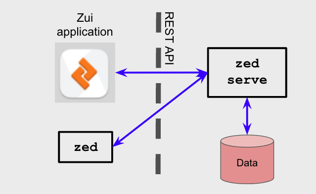
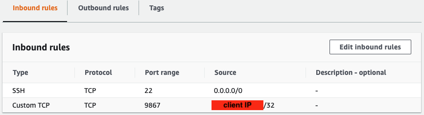
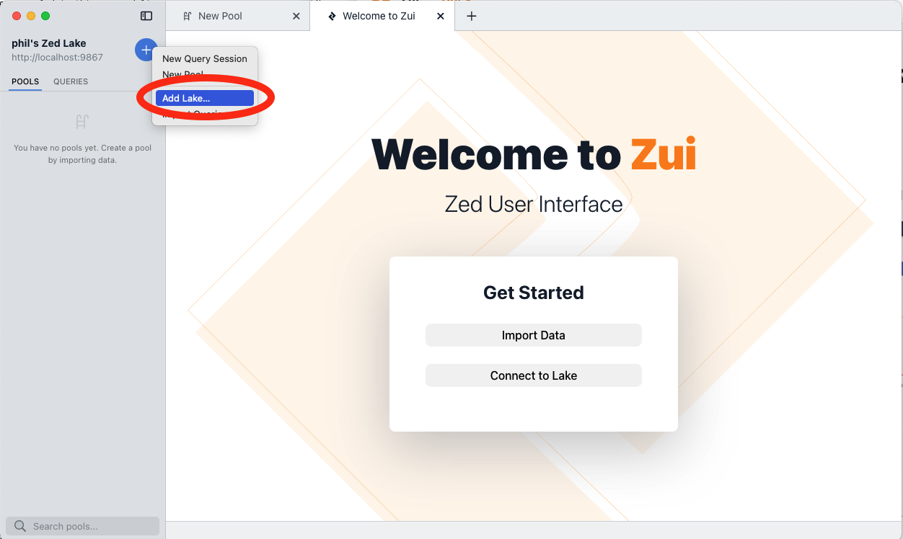
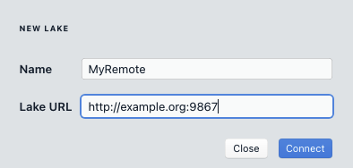
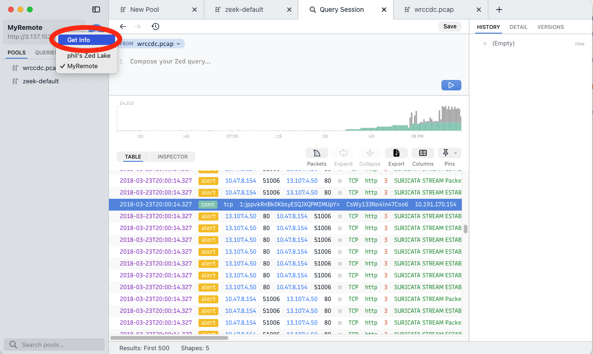

# Remote Zed Lakes

By default, the Zui application connects to a [Zed lake](https://zed.brimdata.io/docs/commands/zed#the-lake-model)
on the system on which it is launched. However, Zui is capable of accessing
data stored in a Zed lake on a remote system. This article describes the
available options and current limitations.

## Limitations

Before diving into the specifics of what's possible, here's an overview of
some rough edges you may encounter as you work through the configurations
described in this article.

1. If a user imports a packet capture while connected to a remote lake, the
   generated logs are stored remotely but the pcap file and corresponding
   index for flow extraction remain local to the user's workstation.

2. While the configuration potentially allows multiple remote users to access
   the same centrally-stored data, there's currently no concept of user
   authentication, individual logins, or roles/permissions. Care should be taken
   to avoid the accidental exposure or loss of centrally-stored data.

## Background: Zui & Zed Lakes

Since it's presented as an icon that can be double-clicked to launch on
your desktop, it's easy to think of Zui as a simple standalone application.
However, the overall app experience is powered by a distributed "backend"
architecture that includes multiple components.

One essential component is the Zed lake which is accessed via a
[`zed serve`](https://zed.brimdata.io/docs/commands/zed#serve)
process that manages the storage and querying of imported data. Operations on
the Zed lake are invoked via a [REST API](https://zed.brimdata.io/docs/lake/api/)
that's utilized by a "client", such as the Zui app. The
[`zed`](https://zed.brimdata.io/docs/commands/zed/) command is also available
as a command line client that can perform many of the same operations as the
Zui app, and therefore may be useful in scripting and automation.



By default, the Zed backend that runs behind Zui stores imported data in a
`lake` subdirectory under the [user data](../support//Filesystem-Paths.md#user-data)
path.

If you examine the process table while Zui is running, you can observe the
command line that was used to start the backend Zed process. For example,
here is the process on a Mac laptop being operated by username "phil".

```
macOS# ps auxww | grep zed | grep -v grep
phil              2409   0.0  0.1 34880932  14784   ??  S     6:38PM   0:00.02 /Applications/Zui.app/Contents/Resources/app.asar.unpacked/zdeps/zed serve -l localhost:9867 -lake /Users/phil/Library/Application Support/Zui/lake -log.level=info -log.filemode=rotate -log.path /Users/phil/Library/Application Support/Zui/logs/zlake.log -brimfd=3
```

Some useful information revealed in this command line:

1. The inclusion of `localhost` in the option `-l localhost:9867` indicates
   this `zed serve` is prepared to accept _only_ connections that arrive from
   a client running on the same local host.

1. The `-lake` option points to the `lake` user data subdirectory for macOS.

1. The `-brimfd=3` is an option unique to when `zed serve` is launched by
   Zui. This helps ensure that if Zui is killed abruptly, the `zed` process will
   also be terminated (see [zed/1184](https://github.com/brimdata/zed/pull/1184)
   for details).

1. We can see the full path to the `zed` binary that's packaged with Zui. This
   binary and other dependencies that are typically launched by Zui can be found
   in the `zdeps` directory under Zui's [application binaries](../support/Filesystem-Paths.md#application-binaries)
   path.

Now that we know Zui is simply connecting to Zed locally, next we'll vary
this approach to instead start a remote `zed serve` and connect to it to
access the data stored there.

## Starting a Remote Zed Lake

For our example remote host, we'll use a Linux Ubuntu 22.04 VM running in
Amazon AWS. Because Zui interacts with `zed serve` over a REST API that
is still evolving, care should be taken to ensure the Zui version being
installed on the remote side matches the version being run locally. In this
article we'll use Zui v1.2.0, which includes Zed v1.9.0.

Even though our VM on AWS has no graphical interface, we'll install the full
Zui package because it includes the compatible Zed binaries as well as a
bundled [Brimcap](https://github.com/brimdata/brimcap) that will prove useful
if we want to import packet capture data.

```
ubuntu# wget --quiet https://github.com/brimdata/zui/releases/download/v1.2.0/zui_1.2.0_amd64.deb
ubuntu# sudo apt update
ubuntu# sudo apt install -y ./zui_1.2.0_amd64.deb
```

The following additional steps are also currently necessary to work around
issue [zui/1701](https://github.com/brimdata/zui/issues/1701).

```
ubuntu# sudo find /opt/Zui/resources/app.asar.unpacked/zdeps/suricata -exec chmod go+w {} \;
ubuntu# /opt/Zui/resources/app.asar.unpacked/zdeps/suricata/suricataupdater
```

:::tip Variation
Rather than the full Zui package, we could instead
[download a Zed package](https://www.brimdata.io/download/). The Zed
package includes the binaries that could be used to construct command lines
similar to those shown below. However, as the Zed tools are part of a general
data system, they do not include Brimcap. This means such a configuration
would either lack the ability to import packet data or would need to be
augmented with a separate Brimcap install. The [custom Brimcap config](https://github.com/brimdata/brimcap/wiki/Custom-Brimcap-Config)
article in the Brimcap wiki provides relevant guidance for this.
:::

Since there's no desktop environment on this VM, there's no "app" interface to
see. Therefore we'll start `zed serve` manually from the
[application binaries](../support/Filesystem-Paths.md#application-binaries) path for the Linux
platform as follows:

```
ubuntu# mkdir -p ~/.config/Zui/lake ~/.config/Zui/plugins/brimcap/storage/root ~/.config/Zui/logs
ubuntu# /opt/Zui/resources/app.asar.unpacked/zdeps/zed serve \
          -l :9867 \
          -lake $HOME/.config/Zui/lake \
          -log.level=info \
          -log.filemode=rotate \
          -log.path $HOME/.config/Zui/logs/zlake.log
```

Building on what we learned earlier, we've made two adjustments here compared
to the command line that Zui would have invoked:

1. `localhost` was dropped from the `-l` option. By providing only the port
   `:9867` specification, `zed serve` is now prepared to accept remote
   connections as well.

2. The `-brimfd=3` was dropped, since we're controlling the start/stop of Zed
   rather than the Zui app.

At this point `zed serve` is ready to accept remote connections. However,
the network between clients and our remote Zed lake needs to permit this
connectivity. You'll need to perform whatever firewall/VPN configuration is
necessary for your environment to enable this. In our specific AWS example, one
way to achieve this is via a [Security Group](https://docs.aws.amazon.com/vpc/latest/userguide/VPC_SecurityGroups.html)
configuration that permits incoming port `9867` connections from our client's
IP address.



## Accessing Our Remote Lake

Now that our remote Zed lake is running, we'll access it from the Zui app
that's running on our Mac laptop.

The option to initiate a remote connection is available by clicking the
"**+**" near the top of the left sidebar and selecting **Add Lake**.



A window will pop up into which we can specify a name for our remote connection
along an HTTP URL including its hostname or IP address and listening port.



Existing pools in our remote Zed lake will appear in the left panel just as we're
accustomed to seeing when working with local data. We can now enter Zed queries
and perform normal workflows.

You can import data (such as the logs shown below) directly from your Zui app to
the remote Zed lake in the same manner as you've been doing locally.


When a packet capture is imported, only the generated logs are stored remotely,
while the pcap file and corresponding index for flow extraction remain local to
your workstation. This maintains the common workflow of clicking the **Packets**
button to extract flows for selected network logs.


Because only your local pcap index was populated, another user remotely
accessing the same pool would be able to query the logs, but in order to
successfully extract flows from it, they would need to obtain and locally index
the same pcap file. The following commands could be executed by such a user on
their Mac workstation to index the same sample pcap
shown above. See [brimcap/105](https://github.com/brimdata/brimcap/issues/105) for more details.

```
Another_User_macOS# wget --quiet https://archive.wrccdc.org/pcaps/2018/wrccdc.2018-03-23.010014000000000.pcap.gz
Another_User_macOS# gunzip wrccdc.2018-03-23.010014000000000.pcap.gz
Another_User_macOS# export PATH="/Applications/Zui.app/Contents/Resources/app.asar.unpacked/zdeps:$PATH"
Another_User_macOS# brimcap index -root "$HOME/Library/Application Support/Zui/plugins/brimcap/storage/root" -r wrccdc.2018-03-23.010014000000000.pcap
```

A connection to a remote lake can be removed by selecting the **Get Info**
option in the pull-down and clicking **Logout**. This only removes the config
in your Zui app that references the remote lake. It does not shutdown the
remote `zed serve` nor does it delete any data stored there.



## Contact us!

If you have questions or feedback about this article, we'd like to hear from
you! Please join our [public Slack](https://www.brimdata.io/join-slack/) or
[open an issue](../support/Troubleshooting.md#opening-an-issue). Thanks!
