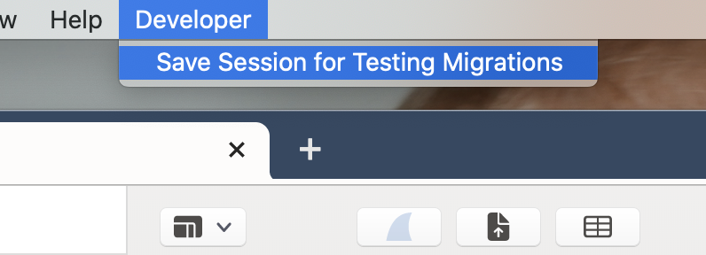
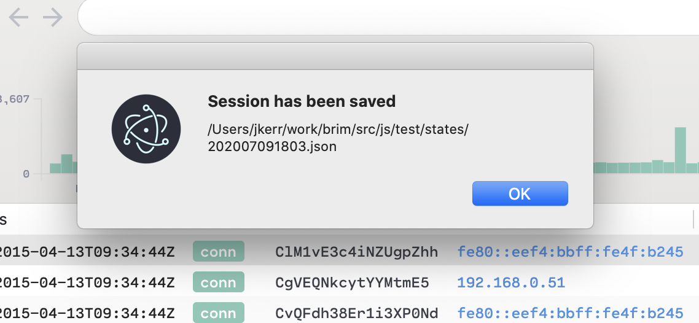

# Adding Migrations

Because we persist state on a user's computer, we must migrate that state each time we release a version that changes the schema expected by the app. If any of the reducers in `src/js/state` are changed, we need to write a migration. When the app starts, it will automatically run all the pending migrations.

## Creating a Migration

Let's say we've added a property called `nickname` to each lake connection in the app. We'll use the migration generator tool to create the necessary files. From the root directory, run `bin/gen migration <name>`. For example:

```bash
bin/gen migration addNicknameToConnection
```

This created a migration file and a test file, each with a timestamp.

```
Created: src/js/state/migrations/202007101024_addNicknameToConnection.js
Created: src/js/state/migrations/202007101024_addNicknameToConnection.test.js
```

The migration function takes the previous state as an parameter and returns the new desired state.

In this case:

```js
export default function addNicknameToConnection(state) {
  // Migrate state here
  return state
}
```

As of this writing, the schema of the persisted state is called `SessionState` and is defined in: `src/js/electron/tron/formatSessionState.js`

## Testing Your Migration

The migrations only ever run when we release a new version. To test your migration, you'll need a sample of the session state from the most recent release tag. Let's say the last release was `v0.13.1`. We can easily get a snapshot of the state at that version following these steps.

```bash
# Remove your "run" directory which clears the app state in development
rm -fr run
# Check out the last version
git checkout v0.13.1
# Start the app
yarn && yarn start
```

Now get the app into a state that you want to test against. In this example, we would add a few connections so we can ensure they have nicknames after the migration.

When ready, go to the App Menu and click `Developer => Save Session for Testing Migrations`.



This will save the session state and inform you where the file is.



The name of the JSON file is just today's date, so it might be helpful to rename it to the version that you're targeting like `v0.13.1.json`

```bash
mv src/js/test/states/202007091803.json src/js/test/states/v0.13.1.json
```

Then in the migration test file, you can access this file using the helper function, `getTestState(name)`.

```js
// src/js/state/migrations/202007101024_addNicknameToConnection.test.js

import getTestState from "src/test/helpers/getTestState"
import migrate from "./202007101024_addNicknameToConnection"

test("202007101024_addNicknameToConnection", () => {
  // The test data we just saved. Returns: {version: string, data: SessionState}
  let {data} = getTestState("v0.13.1")

  const next = migrate(data)

  /* Let's pretend the test data had three connections and the migration added
    "no nickname" as the default nickname for each of them. */
  const {connections} = next.globalState

  expect(connections.length).toBe(3)

  connections.forEach((connection) => {
    expect(connection.nickname).toBe("no nickname")
  })
})
```

Once you've got that test passing, you're home free. The app will see the new migration and run it automatically the next time someone upgrades.
