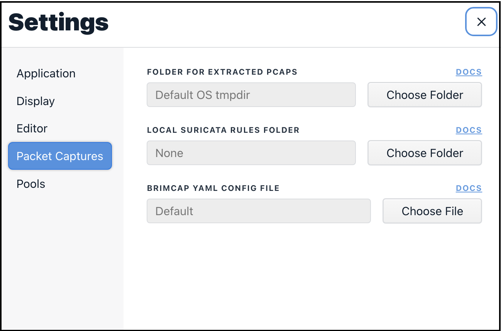

# Packet Captures

The video below describes Zui's features for working with packet capture
([pcap](https://en.wikipedia.org/wiki/Pcap)) data.

Areas covered include:
* The role of [Brimcap](https://github.com/brimdata/brimcap) to generate [Zeek](https://zeek.org/) and [Suricata](https://suricata.io/) summary logs from the pcap
* Views in Zui's **Detail** pane that show:
   * Correlations between different Zeek events and Suricata alerts
   * Ladder diagrams to summarize connection lifecycle
   * Observed file payload activity
* Extracting flows using Zui's **Download Packets** button
* Right-click menu options for querying values in [VirusTotal](https://www.virustotal.com/) and/or [`whois`](https://en.wikipedia.org/wiki/WHOIS)
* Zui [**Settings** for pcap features](#settings)

<iframe width="560" height="315" src="https://www.youtube.com/embed/eMzljqxASVA?si=GQnKRCpKLjc1SUAq" title="YouTube video player" frameborder="0" allow="accelerometer; autoplay; clipboard-write; encrypted-media; gyroscope; picture-in-picture; web-share" referrerpolicy="strict-origin-when-cross-origin" allowfullscreen></iframe>

## Settings

The following sections provide additional detail on the pcap-specific
customizations that can be configured in Zui's **Settings**.

### Folder For Extracted pcaps

When the **Download Packets** button is pressed, the timestamp and duration
details of the underlying Zeek `conn` record are queried in Brimcap's pcap
index to extract the packet data for that single flow. By default, the
generated pcap file is stored in an OS-specific
[temporary directory](../support/Filesystem-Paths.md#temporary-storage).
If you'd prefer to specify an alternate directory (such as if gathering up pcap
evidence for an investigation), clicking the **Choose Folder** button allows
the selection of any other writable destination folder to which Zui should
write extracted pcap flows.

### Local Suricata Rules Folder

By default, the Suricata software that ships with Zui applies the
[Emerging Threats Open](https://community.emergingthreats.net/) rule set when
generating alert events from imported pcap data. This rule set is updated each
time Zui is launched and connected to the Internet.

If you've downloaded one or more additional rule sets that you'd like to
apply, store one or more rule files in a folder on your workstation, then
click the **Choose Folder** button and select the folder. The rules in these
additional files will be included alongside the default Emerging Threats Open
rules whenever Zui updates its Suricata rules.

### Brimcap YAML Config File

The Zeek and Suricata analyzers that are embedded with Zui via Brimcap are
configured with defaults that we hope will serve common pcap use cases.
However, if for some reason you require customizations beyond those in the
settings described above, need to use different release versions of these
analyzers, or make use of other analyzers that generate summary logs from pcaps,
[this Brimcap article](https://github.com/brimdata/brimcap/wiki/Custom-Brimcap-Config)
describes how to create such a custom configuration. The article shows how to
create the configuration in a YAML file. Once you've successfully created and
tested the YAML configuration with Brimcap, click the **Choose File** button,
browse to the YAML file, and select it. Once set, any pcaps you drag into
Zui will be submitted for analysis based on your Brimcap YAML config rather
than the default Zeek and Suricata software that shipped with Zui.
