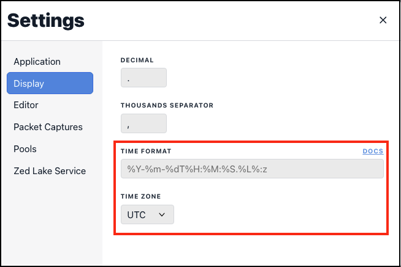

# Time Display

By default, Zui displays Zed `time` values in the Table, Inspector,
and Detail views using [ZSON format](https://zed.brimdata.io/docs/formats/zson#23-primitive-values).
This is an [RFC 3339](https://datatracker.ietf.org/doc/html/rfc3339)
date/time string in nanosecond precision ending in `Z` to indicate
[UTC](https://en.wikipedia.org/wiki/Coordinated_Universal_Time), e.g.,
`2024-08-14T19:12:51.123456789Z`.

Starting with Zui release v1.18.0, two different options in Zui **Settings**
may be used to change the presentation of time values.

1. If the **Time Zone** setting is changed from its default **UTC** while the
   **Time Format** setting remains at its empty default, `time` values will be
   rendered instead in an RFC 3339 format with a numeric offset, e.g.,
   `2024-08-14T12:12:51.123-07:00` for setting `US/Pacific`. This format can be
   represented using [strftime directives](https://github.com/samsonjs/strftime?tab=readme-ov-file#supported-specifiers)
   as `%Y-%m-%dT%H:%M:%S.%L%:z`. Note that this format is acceptable as a
   literal `time` value in a Zed program, e.g., assuming data containing a field
   `ts` of the `time` type, the [search expression](https://zed.brimdata.io/docs/language/search-expressions)
   `ts > 2024-08-14T12:12:51.123-07:00` is syntactically valid.

2. If the **Time Format** setting is changed from its empty default, any
   [strftime directives](https://github.com/samsonjs/strftime?tab=readme-ov-file#supported-specifiers)
   in the setting are used to format time values. For instance the setting
   `%m/%d/%Y` would produce the displayed value `08/14/2024`.

:::tip Note
These settings do not currently change the times shown on the X axis of the
stacked bar chart that appears above query results. Addressing this is tracked
in issue [zui/3141](https://github.com/brimdata/zui/issues/3141). Please add a
comment to the issue if you find it affects your use of Zui.
:::
