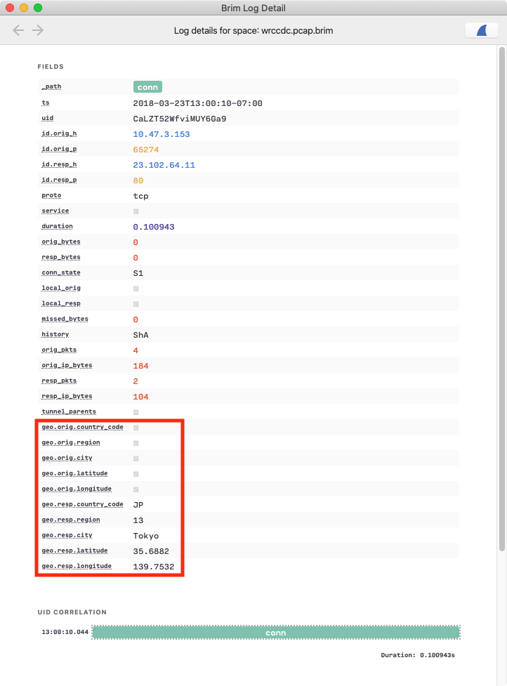
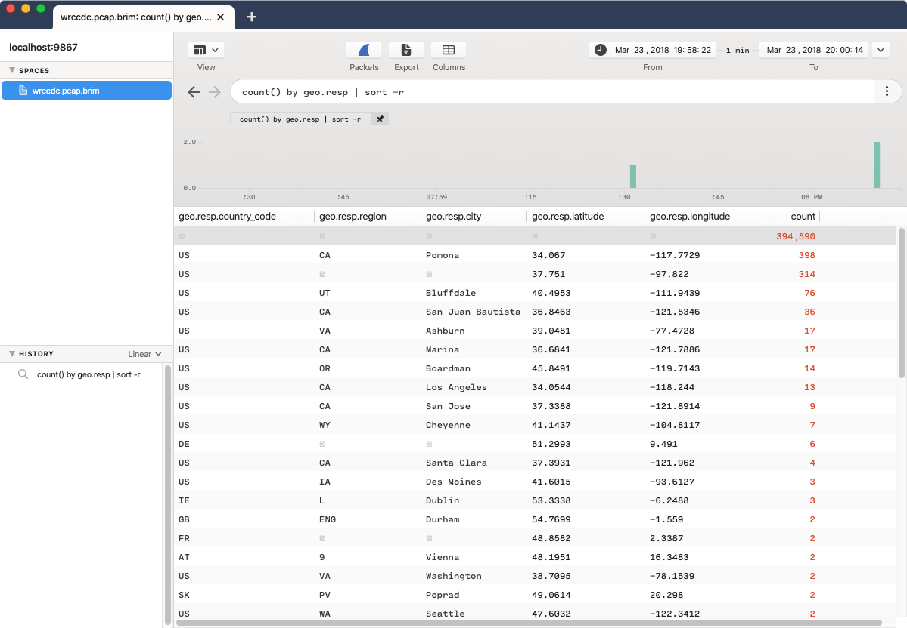

# Geolocation

- [Summary](#summary)
- [Examples](#examples)
- [Origin](#origin)
- [Future Functionality](#future-functionality)

# Summary

Starting with `v0.14.0`, Brim now adds [geolocation](https://en.wikipedia.org/wiki/Geolocation) fields to the `conn` records
of Zeek logs that are generated from imported pcaps.

# Examples

The following screenshot shows where the geolocation fields may be found in the Log Detail view:

This screenshot shows an example aggregation that uses geolocation data:

# Origin

The data is added by the [geoip-conn](https://github.com/brimsec/geoip-conn) Zeek package. For details on the origin and accuracy
of the geolocation data, see the [README](https://github.com/brimsec/geoip-conn/blob/master/README.md).

# Future Functionality

There are additional geolocation features in Brim that may be added in the future, depending on demand from the community.
The following issues are currently being held open to gather interest:

| **Issue**                                              |**Description**                                 |
|--------------------------------------------------------|------------------------------------------------|
| [brim/936](https://github.com/brimsec/brim/issues/936) | Geolocation map visualization                  |
| [brim/954](https://github.com/brimsec/brim/issues/954) | Look up Geolocation data on-demand             |
| [brim/955](https://github.com/brimsec/brim/issues/955) | Allow user to replace the Geolocation database |

If you're interested in additional geolocation features, please follow the links to review these issues and click :+1: below the
description on any of these features you'd like to see added. If you have additional feedback or ideas on this functionality,
feel free to add a comment to the issues, or join our
[public Slack](https://www.brimsecurity.com/join-slack/) and talk to us. Thanks!
