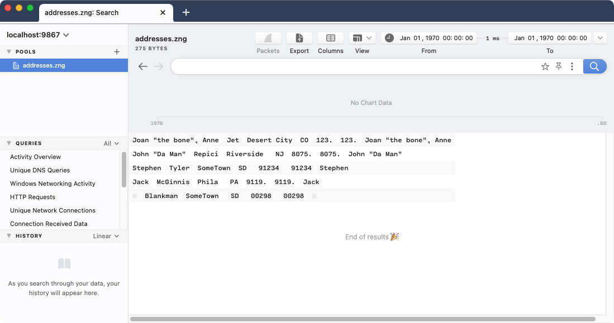

# Importing CSV, JSON, Parquet, and ZST (v0.25.0 and newer)

- [Summary](#summary)
- [Example](#example)
- [Contact us!](#contact-us)

# Summary

Brim's ability to import data of diverse file formats via simple drag & drop
depends on the backend [Zed](https://github.com/brimdata/zed) platform's
ability to "auto-detect" these formats. While several formats are covered by
the current auto-detection implementation,
[CSV](https://tools.ietf.org/html/rfc4180),
[JSON](https://tools.ietf.org/html/rfc8259),
[Parquet](https://parquet.apache.org/), and
[ZST](https://github.com/brimdata/zed/blob/main/docs/formats/zst.md) are not
yet (see [zed/2517](https://github.com/brimdata/zed/issues/2517)).

This article shows how the Zed CLI tools can be used to preprocess data of
these formats into [ZNG](https://github.com/brimdata/zed/blob/main/docs/formats/zng.md)
that can be easily imported into Brim.

# Example

Preprocessing can be performed with the [`zq`](https://github.com/brimdata/zed/blob/main/cmd/zed/README.md#zq)
CLI tool. These Zed CLI tools are included with Brim and can be found in the
`zdeps` directory under the Brim [application binaries](https://github.com/brimdata/brim/wiki/Filesystem-Paths#application-binaries-v0250)
path.

Input file format can be specified via the `-i` option.

```
$ zq -h
NAME
    zed query - apply zed queries to data files or streams

USAGE
    query [ options ] [ zed-query ] file [ file ... ]

OPTIONS
...
    -i format of input data [auto,zng,zst,json,ndjson,zeek,zjson,csv,tzng,parquet] (default "auto")
...
```

Here's an example `zq` command line on macOS to preprocess the test data
from [testxlsx_converted.csv](https://raw.githubusercontent.com/wireservice/csvkit/master/examples/testxlsx_converted.csv)
into ZNG.

```
$ /Applications/Brim.app/Contents/Resources/app.asar.unpacked/zdeps/zq -i csv testxlsx_converted.csv > testxlsx_converted.zng
```

> **Note:** You may want to perform other preprocessing at this phase, such as
invoking [`fuse`](https://github.com/brimdata/zed/tree/main/docs/language/operators#fuse).

Now our `testxlsx_converted.zng` can be imported into Brim.



# Contact us!

If you're struggling with importing alternate file formats or just have
questions, we'd like to hear from you! Please join our
[public Slack](https://www.brimsecurity.com/join-slack/)
and speak up, or [open an issue](https://github.com/brimdata/brim/wiki/Troubleshooting#opening-an-issue). Thanks!
