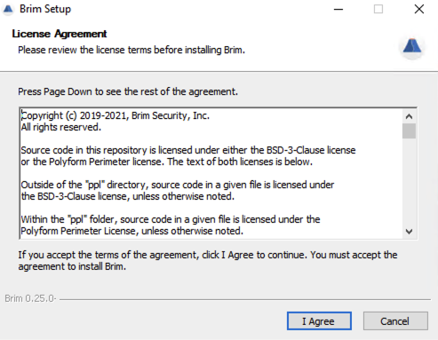
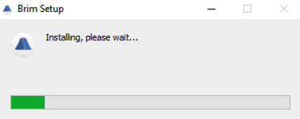
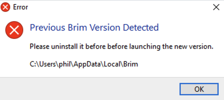
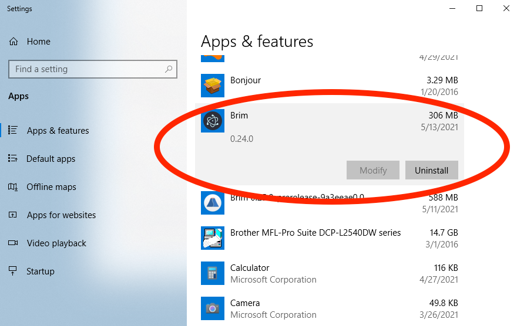

# Installation

Brim is an interactive desktop application for Windows, macOS, and Linux.
To install, click the link at the
[Brim download](https://www.brimsecurity.com/download/) page for your platform
and double-click to launch the installer.

The notes and short videos below show how to successfully install on each
platform.

   * [Windows Installation (v0.25.0+)](#windows-installation-v0250)
   * [Windows Installation (v0.24.0 and older)](#windows-installation-v0240-and-older)
   * [macOS Installation](#macos-installation)
   * [Linux Installation](#linux-installation)

Once installed, no additional configuration is necessary. For your reference,
a separate article describes the [[filesystem paths]] where unpacked Brim
binaries and saved user data are stored on each platform.

Details are provided in each section below about when Brim may "auto-update" to
newer releases and when manual upgrades are necessary. In all cases,
updating to a newer version of the app will preserve your existing
[user data](https://github.com/brimdata/brim/wiki/Filesystem-Paths#user-data-all-versions). As the way user data
is stored sometimes changes in newer releases, downgrades to older releases are
_not_ currently supported.

For a walk through some typical operations in Brim to get started, watch the
[Brim Demo video](https://www.youtube.com/watch?v=InT-7WZ5Y2Y).

If you run into any problems, you may want to browse the
[wiki articles](https://github.com/brimdata/brim/wiki), perhaps starting with
[[Troubleshooting]]. If you get stuck, [join our public Slack](https://www.brimsecurity.com/join-slack/)
and we'll be happy to help.

## Windows Installation (v0.25.0+)

Installation steps are similar as for [`v0.24.0` and older](#windows-installation-v0240-and-older),
with the exception that releases `v0.25.0` and newer include a new installer
that presents a more traditional confirmation prompt and progress bar instead
of the green animation that was shown in older releases.

Also, due to this new installer, `v0.25.0+` will successfully install
alongside an existing Brim `v0.24.0` or older, rather than replacing it.
Therefore the older release must be manually uninstalled before the newer Brim
will successfully launch. If you attempt to launch the newer Brim release while
the older Brim release is still installed, a pop up will inform you of the need
to uninstall, then the new version will immediately exit.

The older version of Brim will be easy to spot among the list of currently-installed Windows programs by its icon and version string.

As Windows releases newer than `v0.25.0` are published, Brim will automatically
download them and pop up a notification offering to restart the app to apply
the update.

## Windows Installation (v0.24.0 and older)

* Download the Brim installer via the Windows link at the [Brim download](https://www.brimsecurity.com/download/) page
* Launch the downloaded `.exe` file to begin installation
* Click through the "unrecognized app" pop-up, if presented (see [[Microsoft Windows beta limitations]]) for details)
* A small green animation will play while installation is completing
* Brim will start automatically when install completes
* Click the Brim icon on the Desktop or Start menu to relaunch in the future

Due to the different installer used in Brim `v0.25.0` and newer, `v0.24.0`
Windows users will _not_ be automatically prompted to update to newer releases.
When you're ready to move to a release `v0.25.0` or newer, follow the steps
[above](#windows-installation-v0250) to manually install the new release and
uninstall the old one.

## macOS Installation

* Download the Brim installer via the macOS link at the [Brim download](https://www.brimsecurity.com/download/) page
* Launch the downloaded `.dmg` file to begin installation
* Drag the Brim icon into the Applications folder
* Click the Brim icon in the Applications folder to start Brim now and in the future
* You may need to click through an "Are you sure?" prompt the first time Brim is launched

As newer macOS releases are published, Brim will automatically download them
and pop up a notification offering to restart the app to apply the update.

## Linux Installation

* Download either the `.deb` or `.rpm` Brim installer at the
  [Brim download](https://www.brimsecurity.com/download/) page, as appropriate
  for your Linux distribution

> **Note:** If an RPM-based Brim `v0.24.0` or older is already installed, it
> must be manually uninstalled (such as via `yum` or `dnf`) before a release
> `v0.25.0` or newer will successfully install. Manual uninstall of older
> releases is _not_ required for DEB-based Brim installs. See
> [[Linux RPM Upgrade (v0.25.0+)]] for more details.

* Open the downloaded `.deb` or `.rpm` file in the Software Install utility and click "Install"
* Enter administration credentials, if prompted
* Click the Brim icon in the applications menu to start the app now and in the future

As newer Linux releases are published, Brim will pop up a notification of their
availability, but the Linux releases do _not_ auto-update. Follow the link in
the pop-up to the [Download](https://www.brimsecurity.com/download/) page to
get the latest release and update it using the appropriate package manager for
your distribution.
