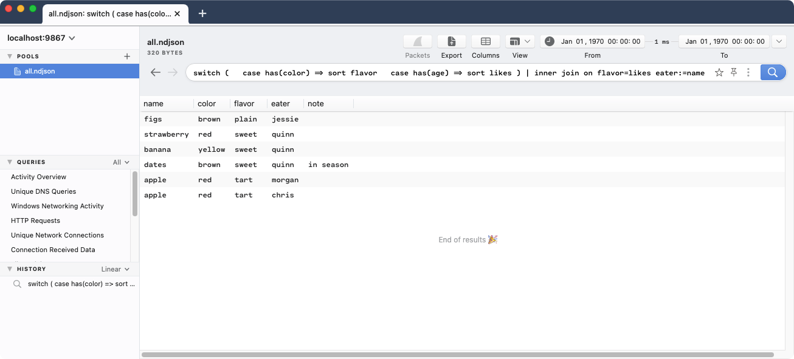
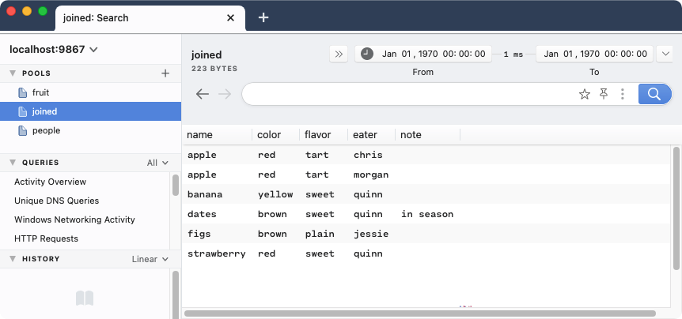

# Joining Data (v0.25.0 and newer)

> **Note:** The details in this article are specific to Brim release `v0.25.0`
> and newer. For information regarding release `v0.24.0` and older, review
> [this article](https://github.com/brimdata/brim/wiki/Joining-Data).

- [Summary](#summary)
- [About Cookbooks](#about-cookbooks)
- [Example Usage](#example-usage)
- [Contact us!](#contact-us)

# Summary

Similar to the well-known [SQL construct](https://en.wikipedia.org/wiki/Join_(SQL)),
the Zed language provides a `join` operator that can be used to combine data
sources. This cookbook describes how it can be used with the Brim application
and discusses its limitations.

# About Cookbooks

Brim cookbooks provide an opportunity to "test drive" new/experimental
features in the Brim application and related [Zed](https://github.com/brimdata/zed)
tools. They also walk through details of how Brim and Zed tools function and
therefore may inspire other creative configurations.

All efforts are made to disclose known caveats and limitations that are
relevant to the configurations shown. However, due to the potential to
encounter bugs in evolving functionality, it is recommended that you initially
follow cookbooks in a non-production, lab-style setting. As such features
become more complete and stable, cookbooks may be retired and replaced with
regular [User Documentation](https://github.com/brimdata/brim/wiki#user-documentation).

Please report any bugs or usability issues you find when working with cookbooks
by [opening an issue](https://github.com/brimdata/brim/wiki/Troubleshooting#opening-an-issue)
or reaching out on the [Brim public Slack](https://www.brimsecurity.com/join-slack/).
We'd also love to hear your success stories and variations, so please don't be
shy!

# Example Usage

By its nature, a join operation requires multiple inputs that will
ultimately be combined. The Zed [`join` docs](https://github.com/brimdata/zed/tree/main/docs/language/operators#join)
show examples with the [Zed CLI tools](https://github.com/brimdata/zed/blob/main/cmd/zed/README.md)
that specify these inputs as named files or Pools in a [Zed Lake](https://github.com/brimdata/zed/blob/main/docs/lake/design.md).

Brim release `v0.25.0` includes initial support for storing data in Zed Lakes.
However, due to a current limitation ([brim/1618](https://github.com/brimdata/brim/issues/1618)),
Zed queries issued from within Brim cannot yet access multiple Pools
simultaneously. Instead such queries are currently limited to accessing the
data from whichever Pool is currently selected from the **Pools** list.

Because of this limitation, the [streamed input example](https://github.com/brimdata/zed/tree/main/docs/language/operators#example-5---streamed-input)
is the only one shown that can currently be executed as is from within Brim.
If the example `fruit.ndjson` and `people.ndjson` was already present in a
single Pool (such as if concatenated into a single file and dragged into the
app), we can see the same query output as shown in the doc.



> **Note:** Because the data being displayed is of multiple different shapes,
> Brim's **Columns** setting has been modified here to set **Headers: On**.

While queries executed from inside Brim are subject to this limitation, the
Zed backend that's launched behind Brim is not. Therefore if you're willing to
perform joins at the shell using [`zapi`](https://github.com/brimdata/zed/blob/main/cmd/zed/README.md#zapi)
you can execute all the other examples shown while accessing data from multiple
Pools. The joined results can be sent into yet another Pool for further query
from within Brim, if desired.

To illustrate this, we'll walk through the [example that shows inputs from Pools](https://github.com/brimdata/zed/tree/main/docs/language/operators#example-4---inputs-from-pools).
To ensure API-compatibility with the Zed backend, we'll use the `zapi` binary
found in the `zdeps` directory under the Brim [application binaries](https://github.com/brimdata/brim/wiki/Filesystem-Paths#application-binaries-v0250)
path, specifically on macOS in this case.

Because Brim already takes care of initializing the Zed Lake, we pick up the
example commands with the creation and population of the separate Pools

```
$ export ZDEPS="/Applications/Brim.app/Contents/Resources/app.asar.unpacked/zdeps"

$ $ZDEPS/zapi create -p fruit -orderby flavor:asc
pool created: fruit

$ $ZDEPS/zapi create -p people -orderby likes:asc
pool created: people

$ $ZDEPS/zapi load -p fruit fruit.ndjson
1ujTdNNId0s6TmVKd02lFRuwzN2 committed

$ $ZDEPS/zapi load -p people people.ndjson
1ujTeU44ZbqdE5x6DvMoTwSkztS committed
```

Finally, we'll use `zapi query` to perform the `join` using the example Zed
script, but we'll pipe its output to a `zapi load` that populates a new Pool
we've created to hold the result. Depending on the nature of the queries you
intend to execute on the data in this Pool, you may wish to specify a different
`-orderby` setting.

```
$ $ZDEPS/zapi create -p joined -orderby name:asc
pool created: joined

$ $ZDEPS/zapi query -I inner-join-pools.zed | $ZDEPS/zapi load -p joined -
1ujUTZvk5KyAoGlSMSGvzFcUGgy committed
```

Now when we select this Pool within Brim, we see our joined data is
displayed in the expected order.



# Contact us!

If you have questions or feedback about this cookbook, we'd like to hear from
you! Please join our [public Slack](https://www.brimsecurity.com/join-slack/) or
[open an issue](https://github.com/brimdata/brim/wiki/Troubleshooting#opening-an-issue). Thanks!
