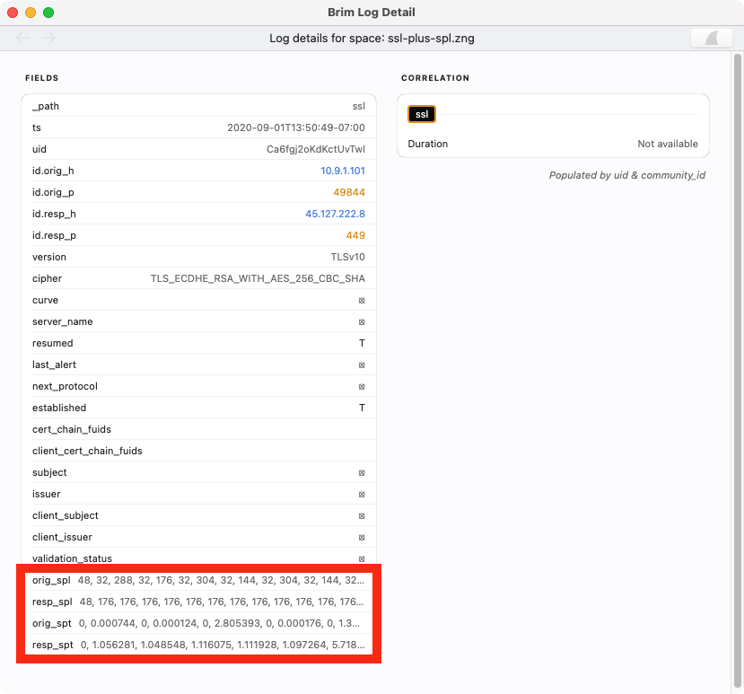
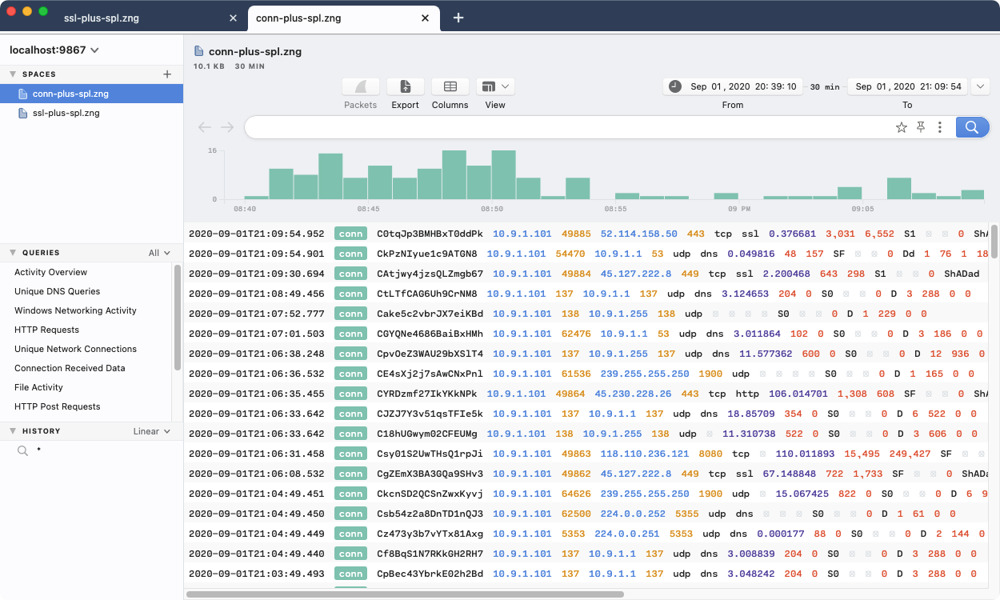
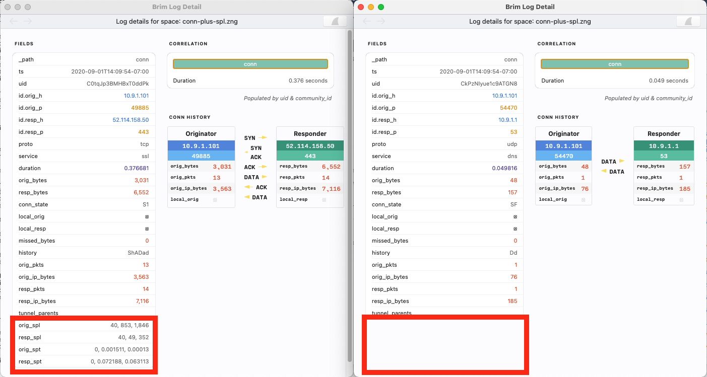
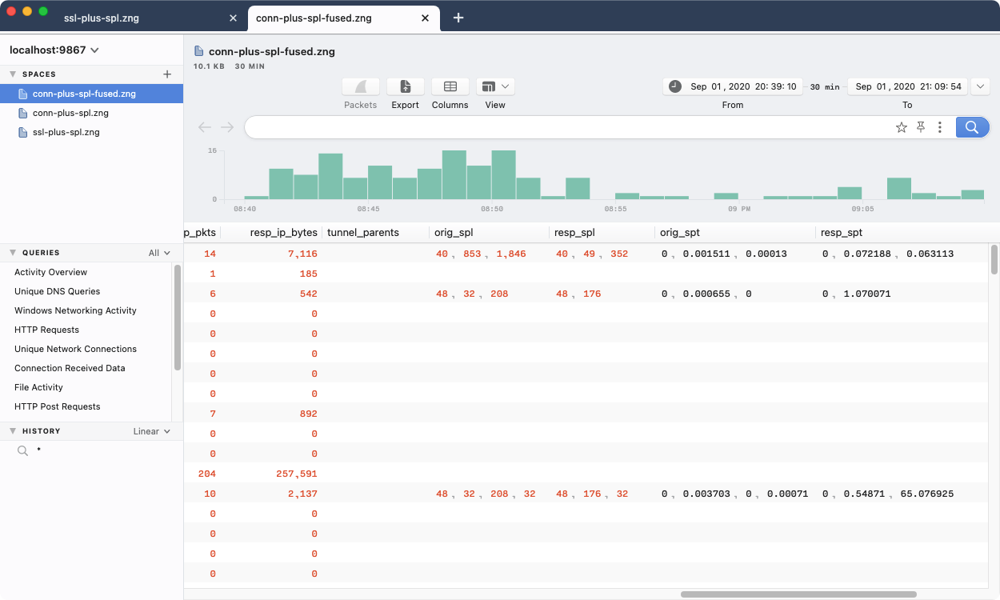
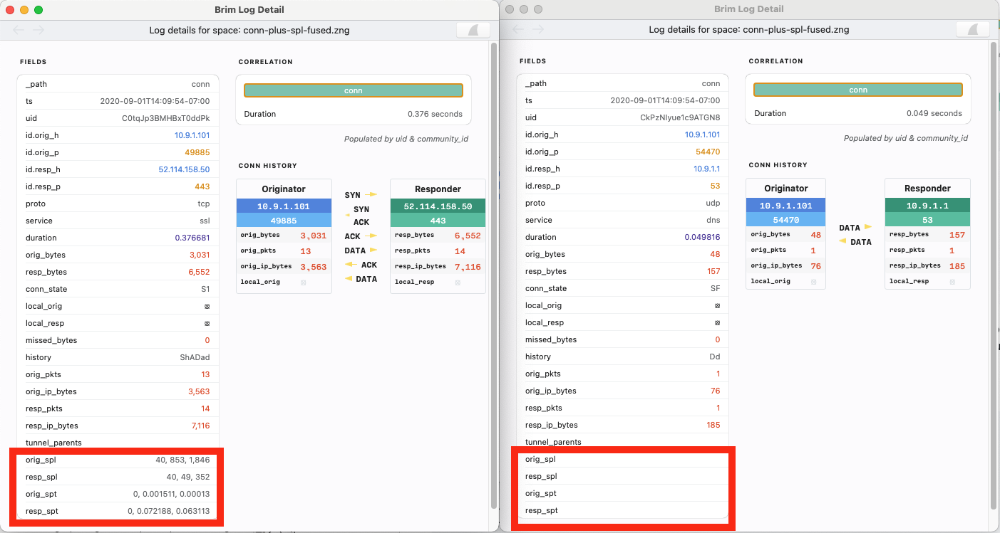

# Joining Data

- [Summary](#summary)
- [About Cookbooks](#about-cookbooks)
- [Limitations](#limitations)
- [Prepping Tools & Test Data](#prepping-tools--test-data)
- [Examples](#examples)
  * [Joining Zeek SSL Records With SPL-SPT Data](#joining-zeek-ssl-records-with-spl-spt-data)
  * [Alternate Schemas For Non-Matches](#alternate-schemas-for-non-matches)
  * [Records Lacking a Join Key](#records-lacking-a-join-key)
- [Contact us!](#contact-us)

# Summary

While the out-of-the-box Zeek and Suricata data typically used in Brim is very
useful on its own, you may want to further enrich it with additional data
sources such as threat intelligence or domain/IP details. A common way to
leverage multiple sources in data technologies is to "join" them together.

The Z language includes a `join` processor that can be used for this. The
processor is still new/experimental and represents the first of what will be
multiple ways of combining different data sources. This cookbook describes
introductory use cases that leverage the current `join` implementation while
discussing its limitations.

# About Cookbooks

Brim cookbooks provide an opportunity to "test drive" new/experimental
features in the Brim application and related [zq](https://github.com/brimsec/zq)
tools. They also walk through details of how Brim and zq tools function and
therefore may inspire other creative configurations.

All efforts are made to disclose known caveats and limitations that are
relevant to the configurations shown. However, due to the potential to
encounter bugs in evolving functionality, it is recommended that you initially
follow cookbooks in a non-production, lab-style setting. As such features
become more complete and stable, cookbooks may be retired and replaced with
regular [User Documentation](https://github.com/brimsec/brim/wiki#user-documentation).

Please report any bugs or usability issues you find when working with cookbooks
by [opening an issue](https://github.com/brimsec/brim/wiki/Troubleshooting#opening-an-issue)
or reaching out on the [Brim public Slack](https://www.brimsecurity.com/join-slack/).
We'd also love to hear your success stories and variations, so please don't be
shy!

# Limitations

Before diving into the specifics of what's possible, here's an overview of
some rough edges you may encounter as you work through the configurations
described in this article.

1. For those familiar with SQL, the current `join` implementation in Z can be
thought of as similar to a [left outer join](https://en.wikipedia.org/wiki/Join_(SQL)#Left_outer_join)
and hence applicable to use cases where that approach would apply.

2. The current `join` implementation is a _merge_-style join that relies on
each stream of input records being sorted by the field being joined. The Z
processors referenced in this cookbook employ "spill-to-disk" functionality
that ensure they can perform the sort/join with arbitrarily large amounts of
data without hitting memory limitations. However, we recognize the approach
may not be as easy-to-use or performant as in-memory approaches that tools
often use for smaller-scale joins. We hope that user feedback will help us
confirm which other approaches to joining we should add next.

3. While the `join` processor is available in the Z language and hence
usable from within Brim, the Brim app currently lacks mechanisms to easily
reference diverse external data sources in the same Space. While these
mechanisms are planned for future releases, the approach described in this
cookbook instead leverages the zq tools outside of Brim with the end result
being the creation of a [ZNG](https://github.com/brimsec/zq/tree/master/zng/docs)-format
log that can be imported into Brim if desired.

# Prepping Tools & Test Data

For this cookbook, we've sought to employ a join-ready data source that
readers can access and follow along with. As many Brim users are already
familiar with [Zeek](https://zeek.org/), we've therefore opted to employ logs
from the Zeek package [SPL-SPT](https://github.com/micrictor/spl-spt), which
provides data about payloads in SSL-encrypted connections. The records produced
by the package include a `uid` value that could be joined to other well-known
Zeek record types that also include the `uid`, such as `ssl` or `conn`. This
would allow the SPL-SPT data to appear as additional columns on these records
as an alternative to pivoting in Brim between the separate logs streams.

As example input data, we'll use the same publicly-available pcap
[2020-09-01-Emotet-epoch-3-infection-with-Trickbot-gtag-mor119.pcap.zip](https://www.malware-traffic-analysis.net/2020/09/02/2020-09-01-Emotet-epoch-3-infection-with-Trickbot-gtag-mor119.pcap.zip)
that's used in the [Hunting Emotet with Brim and Zeek](https://medium.com/brim-securitys-knowledge-funnel/hunting-emotet-with-brim-and-zeek-1000c2f5c1ff)
blog article.

Finally, we'll use a standalone [Zeek v3.2.3](https://github.com/zeek/zeek/releases/tag/v3.2.3)
install to generate logs from our example pcap. Here we've started from a basic
[binary package](https://github.com/zeek/zeek/wiki/Binary-Packages) install
on Linux. After also installing the
[Zeek Package Manager](https://docs.zeek.org/projects/package-manager/en/stable/quickstart.html),
adding the [SPL-SPT](https://github.com/micrictor/spl-spt) package is easy.

```
# zkg install --force https://github.com/micrictor/spl-spt
Installing "https://github.com/micrictor/spl-spt".
Installed "https://github.com/micrictor/spl-spt" (master)
Loaded "https://github.com/micrictor/spl-spt"
```

We unpack our test pcap (password: `infected`) and run it through Zeek to
generate logs.

```
$ unzip 2020-09-01-Emotet-epoch-3-infection-with-Trickbot-gtag-mor119.pcap.zip 
Archive:  2020-09-01-Emotet-epoch-3-infection-with-Trickbot-gtag-mor119.pcap.zip
[2020-09-01-Emotet-epoch-3-infection-with-Trickbot-gtag-mor119.pcap.zip] 2020-09-01-Emotet-epoch-3-infection-with-Trickbot-gtag-mor119.pcap password: 
  inflating: 2020-09-01-Emotet-epoch-3-infection-with-Trickbot-gtag-mor119.pcap

$ cat *.pcap | /opt/zeek/bin/zeek -C -r - spl-spt local

$ ls -l *.log
-rw-rw-r-- 1 phil phil   366 Jan 30 00:38 capture_loss.log
-rw-rw-r-- 1 phil phil 20095 Jan 30 00:38 conn.log
-rw-rw-r-- 1 phil phil 15082 Jan 30 00:38 dns.log
-rw-rw-r-- 1 phil phil   599 Jan 30 00:38 dpd.log
-rw-rw-r-- 1 phil phil 14955 Jan 30 00:38 files.log
-rw-rw-r-- 1 phil phil  6023 Jan 30 00:38 http.log
-rw-rw-r-- 1 phil phil 25744 Jan 30 00:38 loaded_scripts.log
-rw-rw-r-- 1 phil phil  1565 Jan 30 00:38 notice.log
-rw-rw-r-- 1 phil phil   254 Jan 30 00:38 packet_filter.log
-rw-rw-r-- 1 phil phil   566 Jan 30 00:38 pe.log
-rw-rw-r-- 1 phil phil  2818 Jan 30 00:38 spl.log
-rw-rw-r-- 1 phil phil  4891 Jan 30 00:38 ssl.log
-rw-rw-r-- 1 phil phil  1310 Jan 30 00:38 stats.log
-rw-rw-r-- 1 phil phil  1032 Jan 30 00:38 weird.log
-rw-rw-r-- 1 phil phil  5317 Jan 30 00:38 x509.log
```

# Examples

## Joining Zeek SSL Records With SPL-SPT Data

The [SPL-SPT README](https://github.com/micrictor/spl-spt/blob/master/README.md)
explains that the tool analyzes SSL connections. Looking inside the
`ssl.log` and `spl.log`, we can indeed see that the same `uid` values appear
in each, though not in the same order. This highlights the importance of
sorting by `uid` before joining on it.

```
$ cat ssl.log
#separator \x09
#set_separator	,
#empty_field	(empty)
#unset_field	-
#path	ssl
#open	2021-02-05-19-26-55
#fields	ts	uid	id.orig_h	id.orig_p	id.resp_h	id.resp_p	version	cipher	curve	server_name	resumed	last_alert	next_protocol	established	cert_chain_fuids	client_cert_chain_fuids	subject	issuer	client_subject	client_issuer	validation_status
#types	time	string	addr	port	addr	port	string	string	string	string	bool	string	string	bool	vector[string]	vector[string]	string	string	string	string	string
1598992773.193883	CRUIstLprtERqs8c8	10.9.1.101	49816	40.90.22.186	443	TLSv12	TLS_ECDHE_RSA_WITH_AES_256_GCM_SHA384	secp256r1	login.live.com	F	-	h2	T	Fxulet2GsFuEn0Uik4,FjJx5d2slh18Zneyg1	(empty)	CN=login.live.com,O=Microsoft Corporation,L=Redmond,ST=Washington,C=US	CN=DigiCert SHA2 Secure Server CA,O=DigiCert Inc,C=US	-	-	ok
1598992774.249073	COboho3mcULvz2l7yl	10.9.1.101	49819	52.158.208.111	443	TLSv12	TLS_ECDHE_RSA_WITH_AES_128_GCM_SHA256	x25519	watson.telemetry.microsoft.com	F	-	h2	T	FAl8Tn2Kndq0KjRLbc,F9VOZg1nhKg0R59mK4	(empty)	CN=*.big.telemetry.microsoft.com,OU=WSE,O=Microsoft,L=Redmond,ST=WA,C=US	CN=Microsoft Secure Server CA 2011,O=Microsoft Corporation,L=Redmond,ST=Washington,C=US	-	-	unable to get local issuer certificate
1598992776.460850	CN1TBv4cMtawH69YB5	10.9.1.101	49820	52.109.8.20	443	TLSv12	TLS_ECDHE_RSA_WITH_AES_256_CBC_SHA384	secp384r1	nexusrules.officeapps.live.com	F	-	-	T	Fol3JY2CZzUdiaczAh,Fj3y6C1sNWQCOFGPW6	(empty)	CN=nexusrules.officeapps.live.com	CN=Microsoft IT TLS CA 2,OU=Microsoft IT,O=Microsoft Corporation,L=Redmond,ST=Washington,C=US	-	-	ok
1598992772.249387	CUs6Sq3qciVfv4hbr7	10.9.1.101	49815	52.109.8.20	443	TLSv12	TLS_ECDHE_RSA_WITH_AES_256_CBC_SHA384	secp384r1	nexusrules.officeapps.live.com	F	-	-	F	FlOWnD1bpVKj8U6Dnf,FyfwGl3eDHc7yw2Nla	(empty)	-	-	-	-	ok
1598993440.318372	CDLhMi2tO58cin8BMg	10.9.1.101	49841	45.127.222.8	449	TLSv10	TLS_ECDHE_RSA_WITH_AES_256_CBC_SHA	x25519	-	F	-	-	T	F6M76M2wDqQldrfIw4	(empty)	O=Internet Widgits Pty Ltd,ST=Some-State,C=AUO=Internet Widgits Pty Ltd,ST=Some-State,C=AU	-	-	self signed certificate
1598993441.496934	Ci7d2m2sQ358a9L6ej	10.9.1.101	49842	54.221.234.156	443	TLSv12	TLS_ECDHE_RSA_WITH_AES_128_GCM_SHA256	secp256r1	api.ipify.org	F	-	-	T	FZtbib3l8x1ystI3kj,FwcZye35MeWetibizd,FKUAIQ2DxCfmFQPU64	(empty)	CN=*.ipify.org,OU=PositiveSSL Wildcard,OU=Domain Control Validated	CN=COMODO RSA Domain Validation Secure Server CA,O=COMODO CA Limited,L=Salford,ST=Greater Manchester,C=GB	-	-	ok
1598993444.468059	CRjp3u3mrdzkKLXgfh	10.9.1.101	49843	62.108.35.9	447	TLSv12	TLS_ECDHE_RSA_WITH_AES_256_GCM_SHA384	secp256r1	-	F	-	-	T	Fi8GYS3h2Abx3EGXFd	(empty)	CN=example.com,OU=IT Department,O=Global Security,L=London,ST=London,C=GB	CN=example.com,OU=IT Department,O=Global Security,L=London,ST=London,C=GB	-	-	self signed certificate
...


$ cat spl.log
#separator \x09
#set_separator	,
#empty_field	(empty)
#unset_field	-
#path	spl
#open	2021-02-05-19-26-55
#fields	uid	orig_spl	resp_spl	orig_spt	resp_spt
#types	string	vector[count]	vector[count]	vector[double]	vector[double]
CUs6Sq3qciVfv4hbr7	96	-	0.0	-
COboho3mcULvz2l7yl	40,82,33,847,4129,925	40,64,33,50,50,50,37,747	0.0,0.010955,0.000084,0.000095,0.000525,0.00001	0.0,0.000582,0.044301,0.037286,0.0,0.000232,0.0,0.07704
CN1TBv4cMtawH69YB5	96,704	96,16464,16464,8752	0.0,0.003638	0.0,0.081352,0.035947,0.006567
CRUIstLprtERqs8c8	40,82,33,287,4715	40,64,33,50,50,37,11299,33	0.0,0.003105,0.000176,0.000275,0.00025	0.0,0.0,0.071305,0.066583,0.0,0.0,0.017593,0.0
Ci7d2m2sQ358a9L6ej	40,124,26	40,211,26	0.0,0.003581,0.00268	0.0,0.067068,59.334662
CRjp3u3mrdzkKLXgfh	40,191,195,26	40,16408,16408,16408,16408,16408,16408,16408,16408,16408,16408,16408,16408,16408,16408,16408,16408,16408,16408,16408	0.0,0.001702,5.499787,65.32597	0.0,0.494461,0.101639,0.047581,0.128764,0.014464,0.138997,0.004323,0.003257,0.1347,0.003941,0.00431,0.079275,0.059136,0.010274,0.000965,0.005644,0.109902,0.023693,0.000138
Cwhpf01LpV4ChlWZ59	40,82,287,33,4689	40,64,33,50,50,37,11299,33	0.0,0.001331,0.000164,0.000101,0.000109	0.0,0.0,0.073435,0.066108,0.0,0.000109,0.014119,0.0
...
```

The following Z script can join these together by `uid`.

```
$ cat join-uid-ssl.zs 
split (
  => filter _path=ssl | sort uid
  => filter _path=spl | sort uid
) | join uid=uid orig_spl,resp_spl,orig_spt,resp_spt
```

As the name indicates, the `split` processor _splits_ the input stream into
two separately-processed branches, with each branch marked by the `=>` inside
the parentheses. The `filter` processor used here on each branch explicitly
isolates the subset of events processed by each branch. After the `)` closes
the split, the multiple branches are _merged_ back into a single stream before
`join` operates on them.

The first argument to `join` is a Z
[expression](https://github.com/brimsec/zq/blob/master/zql/docs/expressions/README.md)
that references fields in the respective left/right data sources to determine
if a pair of records from each should be joined. In this case, since the field
we're joining on is named `uid` in both data sources, the simple expression
`uid=uid` suffices. The next argument is a comma-separated list of field names
or assignments, similar to how the
[`cut`](https://github.com/brimsec/zq/tree/master/zql/docs/processors#cut)
processor is used.

To apply this using `zq`, we employ its `-P` option that allows us to specify
two or more parallel inputs, with each input being wired up in order to each
branch in our `split`.

```
$ zq -z join-uid-ssl.zs -P ssl.log spl.log > ssl-plus-spl.zng
```

If we import this ZNG into Brim, we can see the additional fields are now
included in the `ssl` events.



This has shown us the "happy path" for data that's best suited for working
with the `join` processor in its current implementation. The following sections
describe some variations where additional Z concepts may be applied to
achieve ideal joins and data presentation.

## Alternate Schemas For Non-Matches

Our test data produced Zeek logs that had a 1-to-1 pairing between 24 Zeek
`ssl` events and 24 `spl` events that described them. However, our experience
would have been different if our left-hand data source had contained
records with `uid` values that did match any records in our right-side `spl`
data source.

Using the logs we've already generated, we can see the effects of this by
instead using the Zeek `conn` records as our left-hand data source, since there
are many non-SSL flows that would have bypassed the SPL-SPT package.

```
$ cat join-uid-conn.zs 
split (
  => filter _path=conn | sort uid
  => filter _path=spl | sort uid
) | join uid=uid orig_spl,resp_spl,orig_spt,resp_spt

$ zq -z join-uid-conn.zs -P conn.log spl.log > conn-plus-spl.zng
```

Once again we can import this ZNG into Brim and see how it looks.



If you click on individual events, you will see that the `join` successfully
added the additional SPL-SPT fields to `conn` events that had a matching `uid`
and not to others.



However, if we look closely at our prior screenshot that showed the initial
splash of all `conn` events, we see something curious. Normally in Brim, if
we're viewing only one Zeek log type, we're accustomed to seeing the data
laid out in columns with headers. However, this did not occur with our joined
ZNG data.

To understand why, it helps to look at our two example `conn` records in
[ZSON](https://github.com/brimsec/zq/blob/master/zng/docs/zson.md) format.

```
$ zq -f zson 'id.orig_p=49885 or id.orig_p=54470' conn-plus-spl.zng
{
    _path: "conn",
    ts: 2020-09-01T21:09:54.901635Z,
    uid: "CGFVvl3LGf6Bw3lZBa" (bstring),
    id: {
        orig_h: 10.9.1.101,
        orig_p: 54470 (port=(uint16)),
        resp_h: 10.9.1.1,
        resp_p: 53 (port)
    } (=0),
    proto: "udp" (=zenum),
    service: "dns" (bstring),
    duration: 49.816ms,
    orig_bytes: 48 (uint64),
    resp_bytes: 157 (uint64),
    conn_state: "SF" (bstring),
    local_orig: null (bool),
    local_resp: null (bool),
    missed_bytes: 0 (uint64),
    history: "Dd" (bstring),
    orig_pkts: 1 (uint64),
    orig_ip_bytes: 76 (uint64),
    resp_pkts: 1 (uint64),
    resp_ip_bytes: 185 (uint64),
    tunnel_parents: null (1=(|[bstring]|))
} (=2)
{
    _path: "conn",
    ts: 2020-09-01T21:09:54.95248Z,
    uid: "Ch7yQn3PwSMC1WcdC5" (bstring),
    id: {
        orig_h: 10.9.1.101,
        orig_p: 49885,
        resp_h: 52.114.158.50,
        resp_p: 443
    } (0),
    proto: "tcp" (zenum),
    service: "ssl" (bstring),
    duration: 376.681ms,
    orig_bytes: 3031 (uint64),
    resp_bytes: 6552 (uint64),
    conn_state: "S1" (bstring),
    local_orig: null (bool),
    local_resp: null (bool),
    missed_bytes: 0 (uint64),
    history: "ShADad" (bstring),
    orig_pkts: 13 (uint64),
    orig_ip_bytes: 3563 (uint64),
    resp_pkts: 14 (uint64),
    resp_ip_bytes: 7116 (uint64),
    tunnel_parents: null (1),
    orig_spl: [
        40 (uint64),
        853 (uint64),
        1846 (uint64)
    ] (=3),
    resp_spl: [
        40,
        49,
        352
    ] (3),
    orig_spt: [
        0e+00,
        1.511e-03,
        1.3e-04
    ] (=4),
    resp_spt: [
        0e+00,
        7.2188e-02,
        6.3113e-02
    ] (4)
} (=5)
```

The presence of the separate [Type Definitions](https://github.com/brimsec/zq/blob/master/zng/docs/zson.md#321-type-definitions)
`(=2)` and `(=5)` shows us how separate schemas were generated for the two
record variations produced by the `join`: The ones that matched on `uid` (and
hence contained the additional SPL-SPT fields) and the ones that didn't.
Meanwhile, Brim's ability to automatically populate column headers is
predicated on query results all falling under a single schema, since the
headers need to reflect all fields expected in the output.

Now that we're recognized this, we can make a small change to our Z to address
it. By adding the [`fuse`](https://github.com/brimsec/zq/tree/master/zql/docs/processors#fuse)
processor, we can ensure all the data is captured under a single, unified
schema.

```
$ cat join-uid-conn-fused.zs
split (
  => filter _path=conn | sort uid
  => filter _path=spl | sort uid
) | join uid=uid orig_spl,resp_spl,orig_spt,resp_spt | fuse

$ zq -z join-uid-conn-fused.zs -P conn.log spl.log > conn-plus-spl-fused.zng
```

Now when the ZNG is loaded into Brim, we immediately see the column headers
and can "scroll right" to confirm the SPL-SPT fields are where we expect to see
them.
 


If we compare our two example events side-by-side again, we see a subtle
difference from what we saw in the non-fused ZNG: Now the SPL-SPT fields on the
non-matching `conn` events _are_ present, but they're populated with explicit
`null` values.



Both this approach and the non-fused one showed earlier are technically
accurate representations of the data, but you may prefer one over the other
depending on your use case.

## Records Lacking a Join Key

In the examples shown thus far, we've worked with individual Zeek log files
that each contain only a single Zeek event type. However, most Brim users are
accustomed to dragging pcaps into the app, which generates a single,
time-sorted log that can be exported into a single ZNG file via Brim's
**Export** button. If you use `zq` to examine such a ZNG file in ZSON format,
you'll see more instances of what we saw earlier with Type Definitions for
different diverse schemas, in this case one per Zeek event type.

Let's assume we've followed the [Zeek Customization](https://github.com/brimsec/brim/wiki/Zeek-Customization)
article to point our Brim at a customized Zeek that includes the SPL-SPT
package. After having imported our test pcap to Brim and extracted the ZNG as
a file `results.zng`, let's look at a count of the different Zeek event types we
find.

```
$ zq -f table 'count() by _path | sort -r' results.zng
_PATH        COUNT
conn         168
dns          99
files        57
http         19
ssl          15
spl          15
x509         12
stats        8
weird        8
capture_loss 3
dpd          3
notice       3
pe           1
```

We're accustomed to seeing the `uid` field in lots of Zeek log types, so what
if we adjusted our earlier approach and tried to add the SPL-SPT fields to
every Zeek event? Here we no longer need the `-P` option since we have all
of our data in the single ZNG file, though we still use `filter` to isolate
the relevant data in each `split` branch.

```
$ cat join-uid-many.zs
split (
  => filter _path!=spl | sort uid
  => filter _path=spl | sort uid
) | join uid=uid orig_spl,resp_spl,orig_spt,resp_spt

$ zq -z join-uid-many.zs -P results.zng results.zng > results-plus-spl.zng

$ zq -f table 'count() by _path | sort -r' results-plus-spl.zng
_PATH  COUNT
conn   168
dns    99
http   19
ssl    15
weird  8
dpd    3
notice 3
```

As we can see, several Zeek event types were not present in our ZNG output.
This happened because the current `join` implementation does not output
left-hand records whose schemas completely lack the referenced join key. Now
that we know this, we can isolate the remaining events and combine them with
our initial set, then see the expected full count.

```
$ zq 'filter not (_path=conn or _path=dns or _path=http or _path=ssl or _path=weird or _path=dpd or _path=notice)' results.zng \
  | zq - results-plus-spl.zng > all-results.zng

$ zq -f table 'count() by _path | sort -r' all-results.zng
_PATH        COUNT
conn         168
dns          99
files        57
http         19
spl          15
ssl          15
x509         12
stats        8
weird        8
dpd          3
notice       3
capture_loss 3
pe           1
```

Of course, we know SPL-SPT only targets SSL traffic, so maybe we're curious
to know if the `join` even succeeded on any of the other Zeek event types. We
can look for this by querying for non-null instances of our expected SPL-SPT
fields.

```
$ zq -f table 'orig_spl!=null or resp_spl!=null or orig_spt!=null or resp_spt!= null | count() by _path' all-results.zng 
_PATH  COUNT
notice 3
spl    15
ssl    15
conn   15
```

If we look closer at those `notice` events, sure enough, they all were related
to SSL traffic and hence it makes sense that they'd contain the `uid` values
that matched in our `join`.

```
$ zq -f table 'orig_spl!=null _path=notice | count() by note' all-results.zng 
NOTE                     COUNT
SSL::Invalid_Server_Cert 3
```

# Contact us!

If you have questions or feedback about this cookbook, we'd like to hear from
you! Please join our [public Slack](https://www.brimsecurity.com/join-slack/) or
[open an issue](https://github.com/brimsec/brim/wiki/Troubleshooting#opening-an-issue). Thanks!
