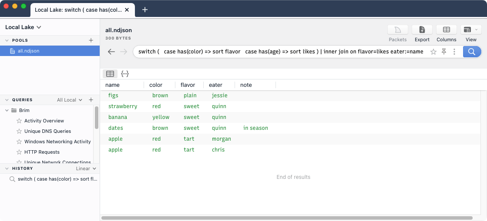
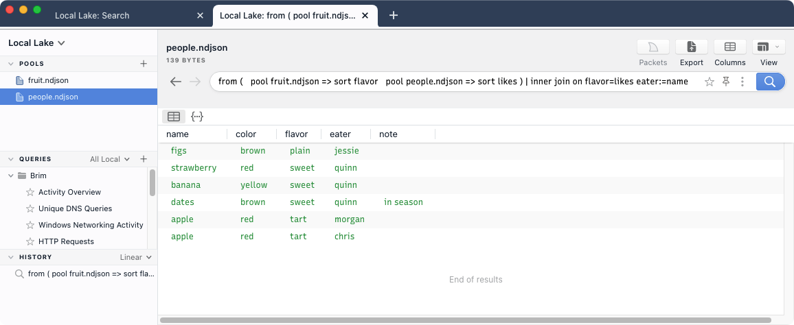

# Joining Data

- [Summary](#summary)
- [About Cookbooks](#about-cookbooks)
- [Example Usage](#example-usage)
- [Contact us!](#contact-us)

# Summary

Similar to the well-known [SQL construct](<https://en.wikipedia.org/wiki/Join_(SQL)>),
the Zed language provides a [`join`](https://zed.brimdata.io/docs/language/operators/join/) operator that can be used to combine data
sources. This cookbook describes how it can be used with the Brim application.

# About Cookbooks

Brim cookbooks provide an opportunity to "test drive" new/experimental
features in the Brim application and related [Zed](https://github.com/brimdata/zed)
tools. They also walk through details of how Brim and Zed tools function and
therefore may inspire other creative configurations.

All efforts are made to disclose known caveats and limitations that are
relevant to the configurations shown. However, due to the potential to
encounter bugs in evolving functionality, it is recommended that you initially
follow cookbooks in a non-production, lab-style setting. As such features
become more complete and stable, cookbooks may be retired and replaced with
regular [User Documentation](https://github.com/brimdata/brim/wiki#user-documentation).

Please report any bugs or usability issues you find when working with cookbooks
by [opening an issue](https://github.com/brimdata/brim/wiki/Troubleshooting#opening-an-issue)
or reaching out on the [Brim public Slack](https://www.brimdata.io/join-slack/).
We'd also love to hear your success stories and variations, so please don't be
shy!

# Example Usage

The same operations shown in the Zed language [`join` tutorial](https://zed.brimdata.io/docs/tutorials/join/)
can be performed in the Brim app. However, the more sophisticated logic of a
`join` operation is often best expressed in a multi-line Zed script A multi-line
editor is planned for a future Brim release
(see [brim/2264](https://github.com/brimdata/brim/issues/2264) for details).
In the meantime, multi-line Zed scripts can be pasted and run in the current
single-line search bar. You may find it helpful to edit your multi-line Zed
scripts in an external editor and paste them into Brim to run them.

By default, the source data used for Zed a query in Brim will be whichever pool
you've currently selected in the **Pools** list in the left panel. Therefore,
the example shown in the [Self Joins](https://zed.brimdata.io/docs/tutorials/join/#self-joins)
section of the tutorial can be run as shown if both the example data sources
have been imported into the same pool (e.g., `cat fruit.ndjson people.ndjson > all.ndjson`
at the shell before dragging `all.ndjson` into Brim).

If the data sources are in separate pools (such as if we'd dragged
`fruit.ndjson` and `people.ndjson` into Brim separately), specify each `pool`
source in `from`. Below is the [Inner Join](https://zed.brimdata.io/docs/tutorials/join/#inner-join)
example from the tutorial run in Brim this way.

# Contact us!

If you have questions or feedback about this cookbook, we'd like to hear from
you! Please join our [public Slack](https://www.brimdata.io/join-slack/) or
[open an issue](https://github.com/brimdata/brim/wiki/Troubleshooting#opening-an-issue). Thanks!
