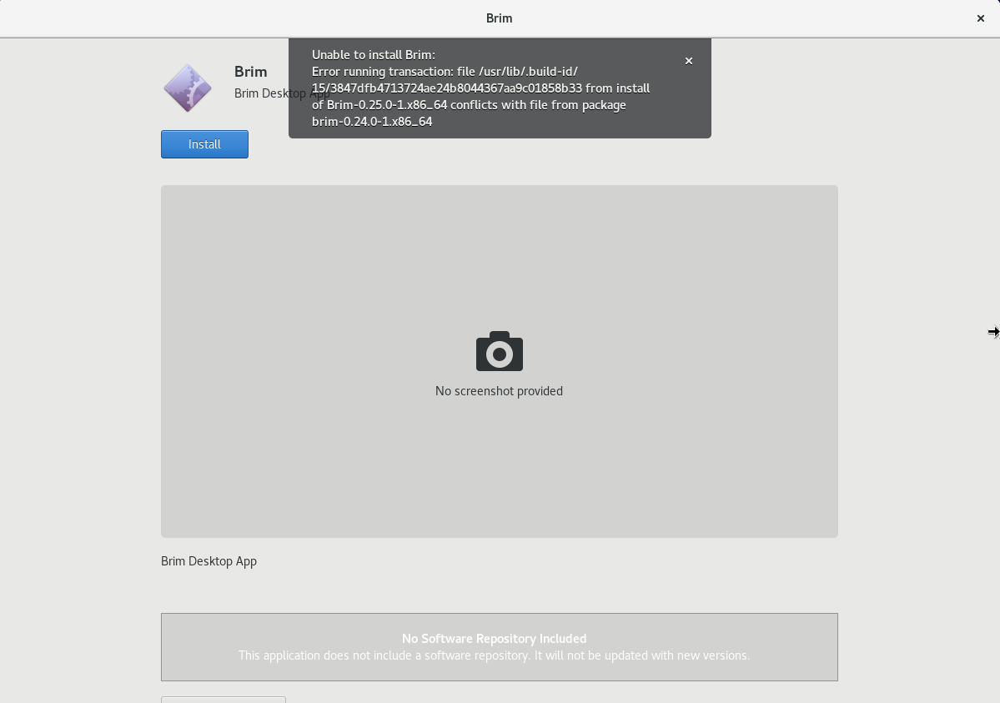

# Linux RPM Upgrade

GA Brim release `v0.25.0` introduced a new toolkit for packaging and installing
the app. The [RPM](https://en.wikipedia.org/wiki/RPM_Package_Manager) packages
for this newer installer are unfortunately incompatible with the RPM packages
from the older system, such that an attempt to install current Brim RPM
packages while an installation of Brim `v0.24.0` (or older) is still present
results in a failure similar to the one shown below.

To resolve the issue, simply uninstall the prior Brim release (e.g., by
executing `yum remove brim` or `dnf remove brim` in your shell) before
re-attempting the install of the new release. All previously-imported data and
app settings (which are stored below the [user data](https://github.com/brimdata/brim/wiki/Filesystem-Paths#user-data)
path, separate from the [application binaries](https://github.com/brimdata/brim/wiki/Filesystem-Paths#application-binaries-v0250))
will still be intact when you now proceed with the install of the newer release.

This is a one-time procedure. Once you successfully install the newer Brim
release, upgrading Brim via RPM packages to future releases will not require
this manual uninstall step.

> **Note:** The procedure described above is _only_ required for Linux
> distributions that use the RPM package format. On distributions that
> use [DEB](https://en.wikipedia.org/wiki/Deb_(file_format)) packaging you
> should be able to install current releases while an older Brim release
> (such as `v0.24.0`) is still present, replacing the older release.

# Contact us!

If you've got questions about upgrades or anything else, we'd like to hear
from you! Please join our [public Slack](https://www.brimdata.io/join-slack/)
and speak up, or [open an issue](https://github.com/brimdata/brim/wiki/Troubleshooting#opening-an-issue). Thanks!
