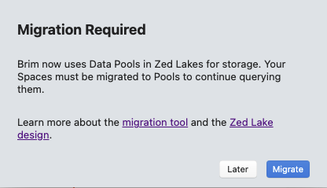
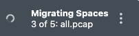
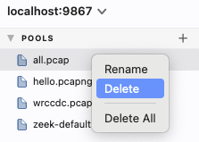

# Migration of Spaces

Starting with GA Brim release `v0.25.0`, imported data is now stored in
pools in a Zed Lake rather than in file-based Spaces as they were previously.

The [Zed Lake README](https://github.com/brimdata/zed/blob/main/docs/zed/README.md)
provides a thorough overview of pools and how they work. In brief, the use of
pools ultimately enables new functionality that was not previously available in
Brim, including:

* Data may be incrementally added to, or deleted from, a pool.
* Zed queries/analytics can make use of data stored across multiple pools.
* Search indexes can be attached to pools to accelerate query performance.
* Pre-computed derived analytics can be leveraged to accelerate computations
  on stored data.

When upgrading to GA Brim release `v0.25.0` or newer, any data you had stored
in Spaces that you wish to continue accessing will need to be migrated to
pools. To ensure a smooth transition, upon first launch in the newer release,
a pop-up message will appear with a clickable option to automatically complete
the data migration.

While the process should be seamless, if you're reading this article before
clicking **Migrate**, here are some tips to help ensure a successful migration.

1. Before starting migration, you may want to make a backup by zipping or
   copying everything below the `spaces` subdirectory under the Brim
   [user data](https://github.com/brimdata/brim/wiki/Filesystem-Paths#user-data)
   path.

2. If you have a lot of data saved in Spaces, the migration may take some time
   to complete. If you click **Later**, the pop-up will be dismissed and you
   can begin importing new data, which will now be stored in pools. You will
   not be able to access the data from your older Spaces until you allow
   migration to complete. The migration pop-up will be presented again the
   next time you relaunch the app or open a new Brim window.

3. If you don't want to migrate the data from your Spaces, you can simply
   delete the `spaces` directory at the filesystem level and the pop-up will no
   longer appear.

4. Once you click **Migrate**, a progress indicator will appear in the
   lower-right corner of the Brim window.

   

   While migration is proceeding, you can use the app as usual (e.g., import new
   data, start querying new pools or ones that have finished migration, etc.)
   When the last Space has been migrated, the now-empty `spaces` directory
   will be automatically deleted at the filesystem layer and the following
   notification will appear:

   

5. During migration, if you click the vertical `...` in the progress indicator
   and select **Cancel**, the new pool configuration for the Space that was
   currently being migrated will be removed by the app. If the Space being
   migrated was large, this cleanup may take several seconds to complete, and
   Brim should be kept open until the following notification appears:

   

   Much the same as if you'd clicked **Later** at the initial migration pop-up,
   after clicking **Cancel**, the next time you relaunch the app or open a new
   Brim window you will be re-prompted to complete migration of the remaining
   Spaces.

6. If you happen to accidentally close the app during cleanup from a cancelled
   migration (or there's some other catastrophic failure), an empty pool
   configuration will be left behind. When this happens, the data for this
   Space will fail to be migrated on a future attempt, with the following
   pop-up appearing:

   

   If this occurs, first click on the pool and confirm that the main event
   window shows the message "No result data". To then allow the migration to
   succeed, right-click on the entry in the pools list and **Delete** it.

   

   The migration pop-up will appear the next time you relaunch the app or open
   a new Brim window and migration will restart for that Space and any other
   remaining Spaces.

7. Even if you had no data saved in Spaces in your older Brim installation,
   the presence of Brim's `spaces` directory on the filesystem will still cause
   the migration pop-up to appear when you first launch the newer version of
   the app. Clicking **Migrate** will delete the `spaces` directory from the
   filesystem such that the pop-up will no longer appear in the future.

# Contact us!

If you have questions about Space migration or anything else, we'd like to hear
from you! Please join our [public Slack](https://www.brimdata.io/join-slack/)
and speak up, or [open an issue](https://github.com/brimdata/brim/wiki/Troubleshooting#opening-an-issue).
Thanks!
