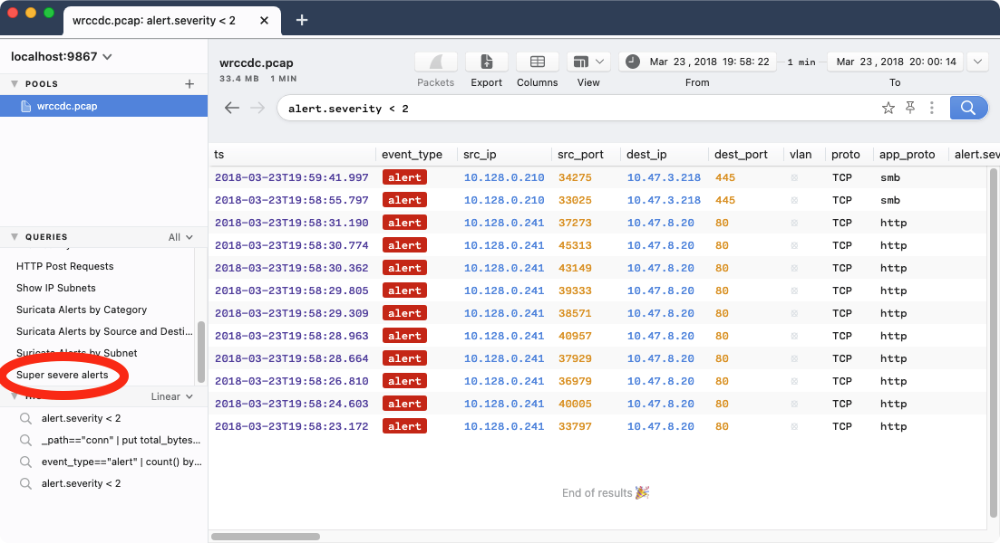

# Query Library Transfer

- [Summary](#summary)
- [About Cookbooks](#about-cookbooks)
- [Limitations](#limitations)
- [Background: `appState.json`](#background-appstatejson)
- [Extracting/Replacing the Query Library](#extractingreplacing-the-query-library)
- [Contact us!](#contact-us)

# Summary

As of Brim release [v0.22.0](https://github.com/brimdata/brim/releases/tag/v0.22.0),
the contents of the Query Library are saved as part of the local app "state"
alongside other persistent data such as the saved entries in the **History**
panel and user **Preferences**. There are plans for future enhancements to
allow Query Library contents to be shared directly between users. While
awaiting these enhancements, this cookbook describes an approach that enables
the manual transfer of Query Library contents between desktops in the current
implementation.

# About Cookbooks

Brim cookbooks provide an opportunity to "test drive" new/experimental
features in the Brim application and related [Zed](https://github.com/brimdata/zed)
tools. They also walk through details of how Brim and Zed tools function and
therefore may inspire other creative configurations.

All efforts are made to disclose known caveats and limitations that are
relevant to the configurations shown. However, due to the potential to
encounter bugs in evolving functionality, it is recommended that you initially
follow cookbooks in a non-production, lab-style setting. As such features
become more complete and stable, cookbooks may be retired and replaced with
regular [User Documentation](https://github.com/brimdata/brim/wiki#user-documentation).

Please report any bugs or usability issues you find when working with cookbooks
by [opening an issue](https://github.com/brimdata/brim/wiki/Troubleshooting#opening-an-issue)
or reaching out on the [Brim public Slack](https://www.brimsecurity.com/join-slack/).
We'd also love to hear your success stories and variations, so please don't be
shy!

# Limitations

The approach described below effectively involves replacing the _entire_
contents of the Query Library, which would be appropriate for a use case such
as replacing an "out-of-the-box" Query Library with a customized one. No
attempts are made to cover more sophisticated operations such as individual
add/delete of entries.

# Background: `appState.json`

Brim maintains persistent user configuration in a file `appState.json` which
is located in Brim's [user data](https://github.com/brimdata/brim/wiki/Filesystem-Paths#user-data-all-versions)
path.

If we peek inside it with a [JSON browser](http://jsonviewer.stack.hu/) or a
tool like [`jq`](https://stedolan.github.io/jq/), we can see where different
types of configuration are kept. For example, here we can see evidence of a
change having been made to the presentation of time values in the
**Preferences** settings.

```
$ cat appState.json | jq '.data.globalState.prefs'
{
  "timeFormat": "dddd, MMMM Do YYYY, h:mm:ss a",
  "dataDir": ""
}
```

And as is relevant for this article, here's the location of the Query Library
entries.

```
$ cat appState.json | jq '.data.globalState.queries'
{
  "id": "root",
  "name": "root",
  "items": [
    {
      "id": "1",
      "name": "Activity Overview",
      "value": "count() by _path | sort -r",
      "description": "This query shows a list of all Zeek streams in the data set, with a count of associated records",
      "tags": [
        "zeek",
        "initial exploration"
      ]
    },
...
```

# Extracting/Replacing the Query Library

For ease of use, we've created a simple Python script
[`qlib_util.py`](https://raw.githubusercontent.com/brimdata/brim/main/scripts/util/qlib_util.py)
that can easily perform this.

```
$ python3 qlib_util.py --help
usage: qlib_util.py [-h] (--extract EXTRACT | --replace REPLACE)
                    [--statepath STATEPATH] [--backup]

Extract/restore Query Library entries from Brim's appState.json

optional arguments:
  -h, --help            show this help message and exit
  --extract EXTRACT, -o EXTRACT
                        Extract Query Library entries from appState.json into
                        the specified output file (default: None)
  --replace REPLACE, -r REPLACE
                        Replace Query Library entries in appState.json with
                        those from the specified input file (default: None)
  --statepath STATEPATH, -s STATEPATH
                        Pathname of appState.json file (default:
                        ./appState.json)
  --backup, -b          Backup appState.json before modifying it (default:
                        True)
```

Let's walk through an example of its use on macOS. Once we've completely exited
Brim, we download the script to the base user data directory where our
`appState.json` is located.

```
$ cd "$HOME/Library/Application Support/Brim"
$ curl -O https://raw.githubusercontent.com/brimdata/brim/main/scripts/util/qlib_util.py
```

To extract the contents of the Query Library to a separate file `saved.json`:

```
$ python3 qlib_util.py --extract saved.json
Successfully extracted Query Library from ./appState.json to saved.json
```

Inside the file, we can see a custom entry created previously.

```
$ cat saved.json 
{
    "id": "root",
    "items": [
...
        {
            "description": "My custom query",
            "id": "9_NZ5OLjXppTQ1ImOjD-X",
            "name": "Super severe alerts",
            "tags": [
                "suricata"
            ],
            "value": "alert.severity < 2"
        }
    ],
    "name": "root"
}
```

Now let's say we've got a separate system where another Brim user wants this
to become their Query Library so they'll have this custom query as well. We
transfer the `saved.json` file to that system, exit Brim completely, then with
the script downloaded as before:

```
$ cd "$HOME/Library/Application Support/Brim"
$ curl -O https://raw.githubusercontent.com/brimdata/brim/main/scripts/util/qlib_util.py
$ python3 qlib_util.py --replace saved.json 
Backing up ./appState.json to /var/folders/yn/jbkxxkpd4vg142pc3_bd_krc0000gn/T/tmpnnfr164v
Successfully replaced the Query Library in ./appState.json with the contents of saved.json
```

Relaunching Brim on the destination system, we can see our custom entry is
present.



# Contact us!

If you have questions or feedback about this cookbook, we'd like to hear from
you! Please join our [public Slack](https://www.brimsecurity.com/join-slack/) or
[open an issue](https://github.com/brimdata/brim/wiki/Troubleshooting#opening-an-issue). Thanks!
