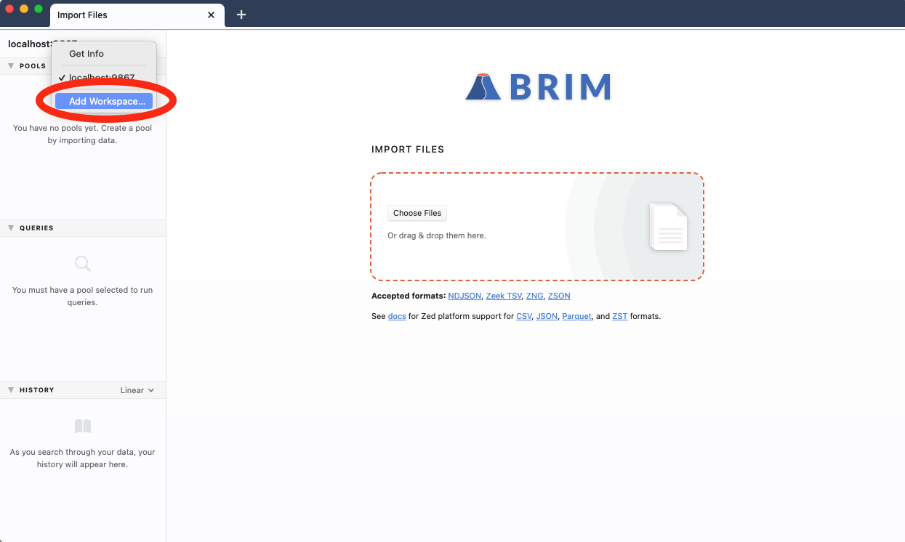

# Remote Workspaces (v0.25.0 and newer)

> **Note:** The details in this article are specific to Brim release `v0.25.0`
> and newer. For information regarding release `v0.24.0` and older, review
> [this article](https://github.com/brimdata/brim/wiki/Remote-zqd).

- [Summary](#summary)
- [About Cookbooks](#about-cookbooks)
- [Limitations](#limitations)
- [Background: Brim & Zed Lakes](#background-brim--zed-lakes)
- [Starting a Remote Zed Lake](#starting-a-remote-zed-lake)
- [Importing Data](#importing-data)
- [Accessing Our Remote Workspace](#accessing-our-remote-workspace)
- [Contact us!](#contact-us)

# Summary

By default, the Brim application connects to a Workspace on the system on which
it is launched. This Workspace includes [Zed Lake](https://github.com/brimdata/zed/blob/main/docs/lake/design.md)
storage on the local filesystem for holding imported data. However, Brim is
capable of accessing data stored in a Zed Lake in a remote Workspace as well.
This cookbook describes the available options and current limitations.

# About Cookbooks

Brim cookbooks provide an opportunity to "test drive" new/experimental
features in the Brim application and related Zed tools. They also walk through
details of how Brim and Zed tools function and therefore may inspire other
creative configurations.

All efforts are made to disclose known caveats and limitations that are
relevant to the configurations shown. However, due to the potential to
encounter bugs in evolving functionality, it is recommended that you initially
follow cookbooks in a non-production, lab-style setting. As such features
become more complete and stable, cookbooks may be retired and replaced with
regular [User Documentation](https://github.com/brimdata/brim/wiki#user-documentation).

Please report any bugs or usability issues you find when working with cookbooks
by [opening an issue](https://github.com/brimdata/brim/wiki/Troubleshooting#opening-an-issue)
or reaching out on the [Brim public Slack](https://www.brimsecurity.com/join-slack/).
We'd also love to hear your success stories and variations, so please don't be
shy!

# Limitations

Before diving into the specifics of what's possible, here's an overview of
some rough edges you may encounter as you work through the configurations
described in this article.

1. While **logs** can be imported from your local Brim app directly to a remote
Workspace, **packet captures** currently cannot.

2. While the configuration potentially allows multiple remote users to access
the same centrally-stored data, there's currently no concept of user
authentication, individual logins, or roles/permissions. Care should be taken
to avoid the accidental exposure or loss of centrally-stored data.

# Background: Brim & Zed Lakes

Since it's presented as an icon that can be double-clicked to launch it on
your desktop, it's easy to think of Brim as a simple standalone application.
However, the overall app experience is powered by a distributed "backend"
architecture that includes multiple components.

One essential component is the Zed Lake which is accessed via a
[`zed lake serve`](https://github.com/brimdata/zed/tree/main/cmd/zed/lake)
process that manages the storage and querying of imported data. Operations on
the Zed Lake are invoked via a [REST API](https://en.wikipedia.org/wiki/Representational_state_transfer)
that's utilized by a "client", such as the Brim app. The
[`zapi`](https://github.com/brimdata/zed/blob/main/cmd/zed/README.md#zapi) command is also available
as a command line client that can perform many of the same operations as the
Brim app, and therefore may be useful in scripting and automation.


The location where Zed stores imported data is known as the
**Data Directory**. This location can be changed via a setting in Brim's
**Preferences** menu. The default location is a `lake` subdirectory under the
Brim [user data](https://github.com/brimdata/brim/wiki/Filesystem-Paths#user-data-all-versions)
path.

If you examine the process table while Brim is running, you can observe the
command line that was used to start the backend Zed process. For example,
here is the process on a Mac laptop being operated by username "phil".

```
macOS# ps auxww | grep zed
phil             37542   0.0  0.0  4277664    760 s001  S+   10:30AM   0:00.01 grep zed
phil             37512   0.0  0.2  5042424  29300   ??  S    10:30AM   0:01.50 /Applications/Brim.app/Contents/Resources/app.asar.unpacked/zdeps/zed lake serve -l localhost:9867 -R /Users/phil/Library/Application Support/Brim/data/lake -log.level=info -log.filemode=rotate -log.path /Users/phil/Library/Application Support/Brim/logs/zlake.log -brimfd=3
```

Some useful information revealed in this command line:

1. The inclusion of `localhost` in the option `-l localhost:9867` indicates
this `zed lake serve` is prepared to accept _only_ connections that arrive from
a client running on the same local host.

1. The `-R` option points to the Data Directory, which is the default
location for macOS in this case.

1. The `-brimfd=3` is an option unique to when `zed lake serve` is launched by
Brim. This helps ensure that if Brim is killed abruptly, the `zed` process will
also be terminated (see [zed/1184](https://github.com/brimdata/zed/pull/1184)
for details).

1. We can see the full path to the `zed` binary that's packaged with Brim. This
binary and other dependencies that are typically launched by Brim can be found
in the `zdeps` directory under Brim's [application binaries](https://github.com/brimdata/brim/wiki/Filesystem-Paths#application-binaries-v0250)
path.

Now that we know Brim is simply connecting to Zed locally, next we'll vary
this approach to instead start a remote `zed lake serve` and connect to it to
access the data stored there.

# Starting a Remote Zed Lake

For our example remote host, we'll use a Linux Ubuntu 18.04 VM running in
Amazon AWS. Because Brim interacts with `zed lake serve` over a REST API that
is still evolving, care should be taken to ensure the Brim version being
installed on the remote side matches the version being run locally. In this
cookbook we'll use Brim v0.25.0, which includes Zed v0.30.0.

Even though our VM on AWS has no graphical interface, we'll install the full
Brim package because it includes the compatible Zed binaries as well as a
bundled [Brimcap](https://github.com/brimdata/brimcap) that will prove useful
if we want to import packet capture data.

```
ubuntu# wget --quiet https://github.com/brimdata/brim/releases/download/v0.25.0/Brim-0.25.0.deb
ubuntu# sudo apt update
ubuntu# sudo apt install -y ./Brim-0.25.0.deb
```

The following additional steps are also currently necessary to work around
issue [brim/1701](https://github.com/brimdata/brim/issues/1701).

```
ubuntu# sudo find /opt/Brim/resources/app.asar.unpacked/zdeps/suricata -exec chmod go+w {} \;
ubuntu# /opt/Brim/resources/app.asar.unpacked/zdeps/suricata/suricataupdater
```

> **Variation:** Rather than the full Brim package, we could instead
> [download a Zed package](https://www.brimsecurity.com/download/). The Zed
> package includes the binaries that could be used to construct command lines
> similar to those shown below. However, as the Zed tools are part of a general
> data system, they do not include Brimcap. This means such a configuration
> would either lack the ability to import packet data or would need to be
> augmented with a separate Brimcap install. The [Custom Brimcap Config](https://github.com/brimdata/brimcap/wiki/Custom-Brimcap-Config)
> article in the Brimcap wiki provides relevant guidance for this.

Since there's no desktop environment on this VM, there's no "app" interface to
see. Therefore we'll start `zed lake serve` manually from the
[application binaries](https://github.com/brimdata/brim/wiki/Filesystem-Paths#application-binaries-v0250) path for the Linux
platform as follows:

```
ubuntu# mkdir -p ~/.config/Brim/data/lake ~/.config/Brim/data/brimcap-root ~/.config/Brim/logs
ubuntu# /opt/Brim/resources/app.asar.unpacked/zdeps/zed lake serve \
          -l :9867 \
          -R $HOME/.config/Brim/data/lake \
          -log.level=info \
          -log.filemode=rotate \
          -log.path $HOME/.config/Brim/logs/zlake.log
```

Building on what we learned earlier, we've made two adjustments here compared
to the command line Brim would have invoked:

1. `localhost` was dropped from the `-l` option. By providing only the port
`:9867` specification, `zed lake serve` is now prepared to accept remote
connections as well.

2. The `-brimfd=3` was dropped, since we're controlling the start/stop of Zed
rather than the Brim app.

At this point `zed lake serve` is ready to accept remote connections. However,
the network between clients and our remote Zed Lake needs to permit this
connectivity. You'll need to perform whatever firewall/VPN configuration is
necessary for your environment to enable this. In our specific AWS example, one
way to achieve this is via a [Security Group](https://docs.aws.amazon.com/vpc/latest/userguide/VPC_SecurityGroups.html)
configuration that permits incoming port `9867` connections from our client's
IP address.


# Importing Data

As mentioned in the [Limitations](#Limitations) above, it's not possible for
remote Brim clients to import packet capture data directly to a remote Zed
Lake. However we can use the bundled `zapi` command line tool to create a Pool
in the Zed Lake for our data and then use the bundled `brimcap` to load data
into it.

As sample packet data, we'll import a [wrccdc pcap](https://wrccdc.org/) from a
separate shell on our Linux VM:

```
ubuntu# wget --quiet https://archive.wrccdc.org/pcaps/2018/wrccdc.2018-03-23.010014000000000.pcap.gz
ubuntu# gunzip wrccdc.2018-03-23.010014000000000.pcap.gz
ubuntu# /opt/Brim/resources/app.asar.unpacked/zdeps/zapi create -p wrccdc
ubuntu# /opt/Brim/resources/app.asar.unpacked/zdeps/brimcap load -p wrccdc -root ~/.config/Brim/data/brimcap-root wrccdc.2018-03-23.010014000000000.pcap
100.0% 476MiB858KiB604B/476MiB858KiB604B records=670822
```

While it's possible to import logs from the Brim app directly into a remote
Zed Lake, we can also use `zapi` on our Linux VM. Here we'll import the Zeek
TSV logs from our [zed-sample-data](https://github.com/brimdata/zed-sample-data).
```
ubuntu# git clone --quiet --depth=1 https://github.com/brimdata/zed-sample-data
ubuntu# /opt/Brim/resources/app.asar.unpacked/zdeps/zapi create -p zed-sample-data
pool created: zed-sample-data

ubuntu# /opt/Brim/resources/app.asar.unpacked/zdeps/zapi load -p zed-sample-data zed-sample-data/zeek-default/*
1uMRE9bZnbNAIY8tEOfIXOa8c2w committed
```

To see our imported data as Pools in the Zed Lake:

```
ubuntu# /opt/Brim/resources/app.asar.unpacked/zdeps/zapi ls
wrccdc 1uMPHXonxiBH1gY6TCCFxBNS99Z key ts order desc
zed-sample-data 1uMR6rGmrSBRHnB0yqOGnzhQb0b key ts order desc
```

# Accessing Our Remote Workspace

Now that we've got data imported into our remote Zed Lake, we'll access it from
the Brim app that's running on our Mac laptop.

The option to initiate a remote connection is available by clicking the
pull-down above the Pools list in the left panel and selecting **Add
Workspace**.



A window will pop up into which we can specify a name for our remote connection
along with its hostname or IP address. An optional port specification may also
be included if it's listening on a port other than the default `9867`.


Now the Pools in our remote Zed Lake will appear in the left panel just as we're
accustomed to seeing when working with local data. We can now enter Zed queries
and perform normal workflows.

For our Pool that was based on the imported packet capture, we'll only be able
to extract flows into Wireshark via the **Packets** button if we maintain a
copy of the same pcap locally and add it to the index in our local Brimcap root
(see [brimcap/105](https://github.com/brimdata/brimcap/issues/105) for details).

```
macOS# wget --quiet https://archive.wrccdc.org/pcaps/2018/wrccdc.2018-03-23.010014000000000.pcap.gz
macOS# gunzip wrccdc.2018-03-23.010014000000000.pcap.gz
macOS# /Applications/Brim.app/Contents/Resources/app.asar.unpacked/zdeps/brimcap index -root "$HOME/Library/Application Support/Brim/data/brimcap-root" -r wrccdc.2018-03-23.010014000000000.pcap
```	


You can import logs (but not pcaps) directly from your Brim app to the remote
Zed Lake in the same manner as you've been doing locally.


Attempts to import a pcap directly to the remote Workspace will fail with an
error message (see [brimcap/106](https://github.com/brimdata/brimcap/issues/106)
for details).

A connection to a remote Workspace can be removed by selecting the **Get Info**
option in the pull-down and clicking **Logout**. This only removes the config
in your Brim app that references the remote Workspace. It does not shutdown the
remote `zed lake serve` nor does it delete any data stored there.


# Contact us!

If you have questions or feedback about this cookbook, we'd like to hear from
you! Please join our [public Slack](https://www.brimsecurity.com/join-slack/) or
[open an issue](https://github.com/brimdata/brim/wiki/Troubleshooting#opening-an-issue). Thanks!
