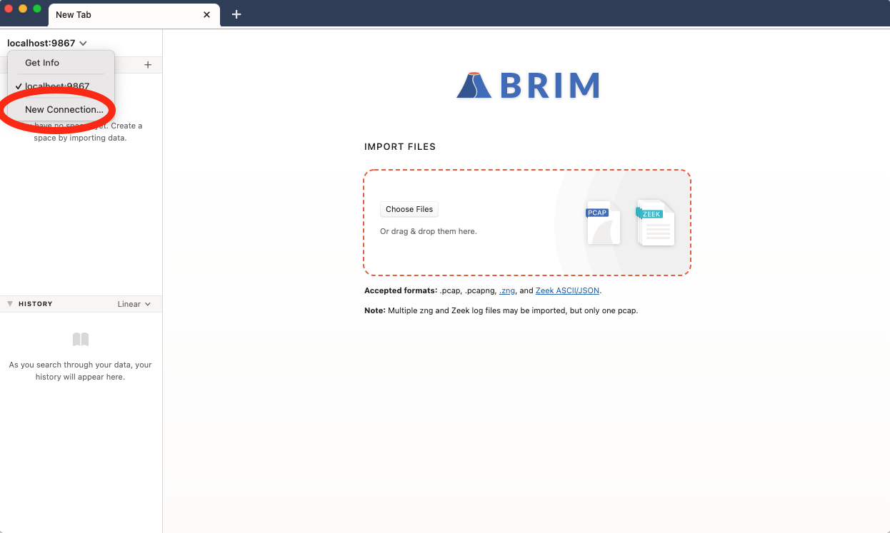
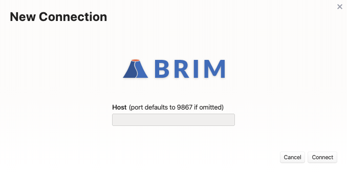
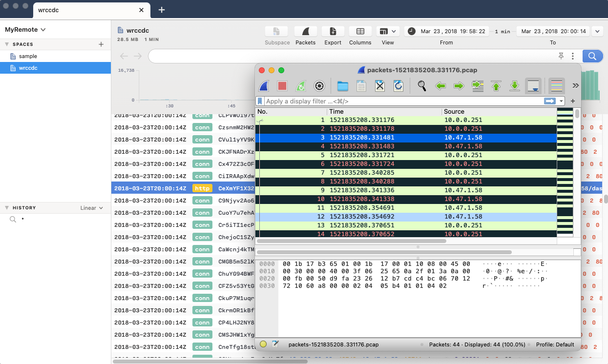

# Remote `zqd`

- [Summary](#summary)
- [About Cookbooks](#about-cookbooks)
- [Limitations](#limitations)
- [Background: Brim & `zqd`](#background-brim--zqd)
- [Starting a Remote `zqd`](#starting-a-remote-zqd)
- [Importing Data](#importing-data)
- [Accessing Our Remote `zqd`](#accessing-our-remote-zqd)
- [Frequently Asked Questions](#frequently-asked-questions)

# Summary

By default, the Brim application leverages the local filesystem for holding
imported logs and packet capture data. However, new features available in Brim
starting with v0.20.0 and related [zq tools](https://github.com/brimsec/zq)
starting with v0.24.0 enable access to data stored remotely as well. This
cookbook describes the available options and current limitations.

# About Cookbooks

Brim cookbooks provide an opportunity to "test drive" new/experimental
features in the Brim application and related zq tools. They also walk through
details of how Brim and zq tools function and therefore may inspire other
creative configurations.

All efforts are made to disclose known caveats and limitations that are
relevant to the configurations shown. However, due to the potential to
encounter bugs in evolving functionality, it is recommended that you initially
follow cookbooks in a non-production, lab-style setting. As such features
become more complete and stable, cookbooks may be retired and replaced with
regular [User Documentation](https://github.com/brimsec/brim/wiki#user-documentation).

Please report any bugs or usability issues you find when working with cookbooks
by [opening an issue](https://github.com/brimsec/brim/wiki/Troubleshooting#opening-an-issue)
or reaching out on the [Brim public Slack](https://www.brimsecurity.com/join-slack/).
We'd also love to hear your success stories and variations, so please don't be
shy!

# Limitations

Before diving into the specifics of what's possible, here's an overview of
some rough edges you may encounter as you work through the configurations
described in this article.

1. While **logs** can be imported from your local Brim app directly to a remote
`zqd`, **packet captures** currently cannot. Any packet captures you wish to
access remotely will need to have been staged at the remote location.

2. While the configuration potentially allows multiple remote users to access
the same centrally stored logs and packet captures, there's currently no
concept of user authentication, individual logins, or roles/permissions. Care
should be taken to avoid the accidental exposure or loss of centrally-stored
data.

3. The Brim application does not yet immediately reflect the availability of
new data as soon as it's added to a remote location. The steps below provide
guidance on how to "refresh" the Brim interface to ensure all remote data is
visible.

# Background: Brim & `zqd`

Since it's presented as an icon that can be double-clicked to launch it on
your desktop, it's easy to think of Brim as a simple standalone application.
However, it actually includes some "backend" components that assist in
providing the overall app experience.

One essential component is [`zqd`](https://github.com/brimsec/zq/tree/master/cmd/zqd),
a server-style process that manages the storage and querying of imported
log/packet data.  Operations in `zqd` are invoked via a
[REST API](https://en.wikipedia.org/wiki/Representational_state_transfer)
that's utilized by a "client", such as the Brim app and/or the
[`zapi`](https://github.com/brimsec/zq/tree/master/cmd/zapi) command line tool.


The location where `zqd` stores imported data is known as the
**Data Directory**. This location can be changed via a setting in Brim's
**Preferences** menu. The default Data Directory locations on each platform
are as follows:

|**OS Platform**|**Location**|
|---------------|------------|
| **Windows**   | `%APPDATA%\Brim\data\spaces`                         |
| **macOS**     | `$HOME/Library/Application Support/Brim/data/spaces` |
| **Linux**     | `$HOME/.config/Brim/data/spaces`                     |

If you examine the process table while Brim is running, you can observe the
command line that was used to start the backend `zqd` process. For example,
here is the process on a Mac laptop being operated by username "phil".

```
macOS# ps auxww | grep zqd
phil             29475 180.6  0.2  5042684  32340   ??  R     4:38PM   0:01.16 /Applications/Brim.app/Contents/Resources/app/zdeps/zqd listen -l localhost:9867 -data /Users/phil/Library/Application Support/Brim/data/spaces -config /Users/phil/Library/Application Support/Brim/zqd-config.yaml -zeekrunner /Applications/Brim.app/Contents/Resources/app/zdeps/zeek/zeekrunner -brimfd=3
```

Some useful information revealed in this command line:

1. The presence of the `listen` command indicates that the `zqd` process is
prepared to accept REST API requests.

2. The inclusion of `localhost` in the option `-l localhost:9867` indicates
this `zqd` is prepared to accept _only_ connections that arrive from a client
running on the same local host.

3. The `-data` option points to the Data Directory, which is the default
location for macOS in this case.

4. The `-zeekrunner` option points to a script that is used to initiate the
creation of Zeek logs from imported packet captures as described in the
[Zeek Customization](https://github.com/brimsec/brim/wiki/Zeek-Customization)
article.

5. The `-brimfd=3` is an option unique to when `zqd` is launched by Brim.
This helps ensure that if Brim is killed abruptly, the `zqd` process will also
be terminated (see [zq/1184](https://github.com/brimsec/zq/pull/1184) for
details).

6. We can see the full path to the `zqd` binary that's packaged with Brim. This
binary and other dependencies that are typically launched by Brim can be found
in the following location on each platform:

   |**OS Platform**|**Location**|
   |---------------|------------|
   | **Windows**   | `%USERPROFILE%\AppData\Local\Brim\app-<version>\resources\app\zdeps` |
   | **macOS**     | `/Applications/Brim.app/Contents/Resources/app/zdeps` |
   | **Linux**     | `/usr/lib/brim/resources/app/zdeps`                   |

Now that we know Brim is simply connecting to `zqd` locally, nexy we'll vary
this approach to instead start a remote `zqd` and connect to it to access the
logs and packet captures stored there.

# Starting a Remote `zqd`

For our example remote host, we'll use a Linux Ubuntu 18.04 VM running in
Amazon AWS. Because Brim interacts with `zqd` over a REST API that is still
evolving, care should be taken to ensure the Brim version being installed on
the remote side matches the version being run locally. In this cookbook we'll
use Brim v0.20.0, which includes `zqd` v0.24.0.

Even though our VM on AWS has no graphical interface, we'll install the full
Brim package because it includes the compatible `zqd` binary as well as an
embedded Zeek that will prove useful if we want to import packet capture data.

```
ubuntu# wget https://github.com/brimsec/brim/releases/download/v0.20.0/brim_amd64.deb
ubuntu# sudo apt install -y ./brim_amd64.deb
```

---

* **Variation:** Rather than the full Brim package, we could instead have
[downloaded a zq package](https://www.brimsecurity.com/download/). The zq
package includes the `zqd` and `zapi` binaries that could be used to construct
command lines similar to those shown below. However, the zq tools do not
include an embedded Zeek, so such a configuration would either lack the
ability to import packet data, or would require the creation of a separate Zeek
installation and runnner that could be enabled via the steps described in the
[Zeek Customization](https://github.com/brimsec/brim/wiki/Zeek-Customization)
article.

---

Since there's no desktop environment on this VM, there's no "app" interface to
see. Therefore we'll use the path information for the Linux platform shown
above to start `zqd` manually with a couple modifications, as follows:

```
ubuntu# mkdir -p ~/.config/Brim/data/spaces
ubuntu# /usr/lib/brim/resources/app/zdeps/zqd listen \
          -l :9867 \
          -data /home/ubuntu/.config/Brim/data/spaces \
          -zeekrunner /usr/lib/brim/resources/app/zdeps/zeek/zeekrunner
```

Building on what we learned earlier, the two adjustments we made:

1. `localhost` was dropped from the `-l` option. By providing only the port
`:9867` specification, `zqd` is now prepared to accept remote connections as
well.

2. The `-brimfd=3` was dropped, since we're controlling the start/stop of `zqd`
rather than the Brim app.

At this point `zqd` is ready to accept remote connections. However, the network
between clients and our `zqd` needs to permit this connectivity. You'll need to
perform whatever firewall/VPN configuration is necessary for your environment
to enable this. In our specific AWS example, one way to achieve this is via a
[Security Group](https://docs.aws.amazon.com/vpc/latest/userguide/VPC_SecurityGroups.html)
configuration that permits incoming port `9867` connections from our client's
IP address.


# Importing Data

As mentioned in the [Limitations](#Limitations) above, it's not currently
possible for remote Brim clients to import packet cpature data directly to a
remote `zqd`. However we can use the `zapi` command line tool on our VM to
access this `zqd` directly via `localhost`.

As sample packet data, we'll import a
[wrccdc pcap](https://archive.wrccdc.org/pcaps/2018/) from a separate shell on
our Linux VM:

```
ubuntu# wget --quiet https://archive.wrccdc.org/pcaps/2018/wrccdc.2018-03-23.010014000000000.pcap.gz
ubuntu# gunzip wrccdc.2018-03-23.010014000000000.pcap.gz
ubuntu# /usr/lib/brim/resources/app/zdeps/zapi -s wrccdc postpcap -f wrccdc.2018-03-23.010014000000000.pcap 
100.0% 500.0MB/500.0MB
/home/ubuntu/wrccdc.2018-03-23.010014000000000.pcap: pcap posted
```

While it's possible to import logs from the Brim app directly into a remote
`zqd`, we can also use `zapi` on our Linux VM. Here we'll import the Zeek TSV
logs from our [zq-sample-data](https://github.com/brimsec/zq-sample-data).

```
ubtunu# git clone --quiet --depth=1 https://github.com/brimsec/zq-sample-data.git
ubuntu# /usr/lib/brim/resources/app/zdeps/zapi -s sample postpath -f zq-sample-data/zeek-default/*
100.0% 44.71MB/44.71MB
posted 44.71MB in 21.252418033s
```

To see our imported data as Spaces:

```
ubuntu# /usr/lib/brim/resources/app/zdeps/zapi ls -l
sample
  id:           sp_1iIUQUsAAhUw7kpF0UoOcFNWxqj
  name:         sample
  data_path:    file:///home/ubuntu/.config/Brim/data/spaces/sp_1iIUQUsAAhUw7kpF0UoOcFNWxqj
  storage_kind: filestore
  span:         2018-03-24T17:15:20Z+21m9.558041001s
  size:         80.05MB
  pcap_support: false
  pcap_size:    0B
  pcap_path:    
  parent_id:    
wrccdc
  id:           sp_1iIUcu5BQV92uz7v6rbIqSzT4BI
  name:         wrccdc
  data_path:    file:///home/ubuntu/.config/Brim/data/spaces/sp_1iIUcu5BQV92uz7v6rbIqSzT4BI
  storage_kind: filestore
  span:         2018-03-23T19:58:22Z+1m51.694792001s
  size:         18.52MB
  pcap_support: true
  pcap_size:    500.0MB
  pcap_path:    file:///home/ubuntu/wrccdc.2018-03-23.010014000000000.pcap
  parent_id:    
```

# Accessing Our Remote `zqd`

Now that we've got data imported into our remote `zqd`, we'll access it from
the Brim app that's running on our Mac laptop.

The option to initiate a remote connection is available by clicking the
pull-down that's normally above the Spaces list in the left panel.



A window will pop up into which we can specify a name for our remote connection
along with its hostname or IP address. An optional port specification may also
be included if it's listening on a port other than the default `9867`.



Now the Spaces on our remote `zqd` will appear in the left panel just as we're
accustomed to seeing when working with local data. We can now enter ZQL queries
and perform all normal workflows. For our Space that was based on the imported
packet capture, we can extract flows into Wireshark via the **Packets** button
as usual.



Additional Spaces created on the remote `zqd` are not automatically shown in
the Brim app. To trigger an immediate refresh, select **View > Reload** from
the Brim drop-down menu.

---

Text still to be added when the features exist:
* Deleting a remote connection ([brim/1191](https://github.com/brimsec/brim/issues/1191))
* Importing logs to a remote `zqd` ([brim/1094](https://github.com/brimsec/brim/issues/1094))

# Frequently Asked Questions

(Show the error messsage from a failed attempt to import a pcap to a remote
`zqd` and reiterate that this is currently unsupported. Issue
[brim/1221](https://github.com/brimsec/brim/issues/1221) is tracking whether we
can improve this error message first.)
