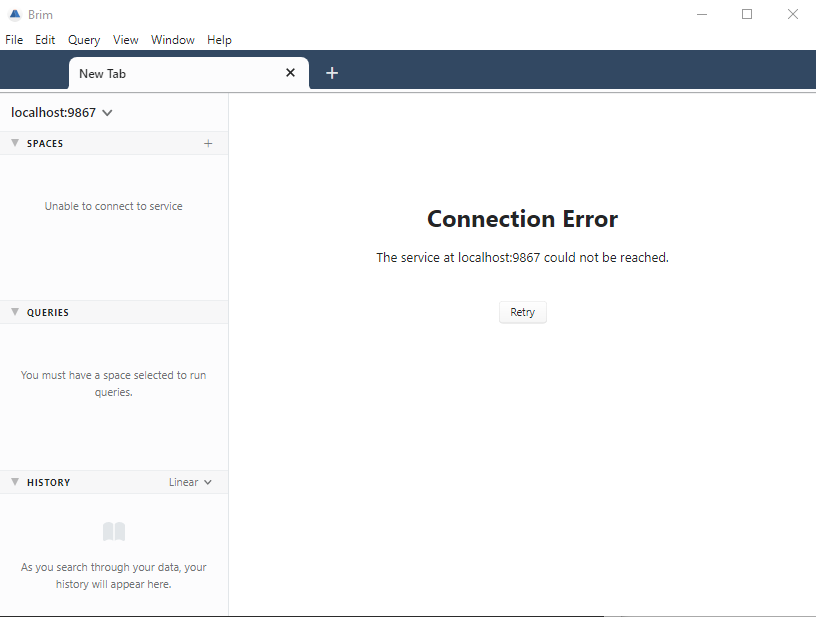
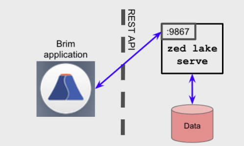
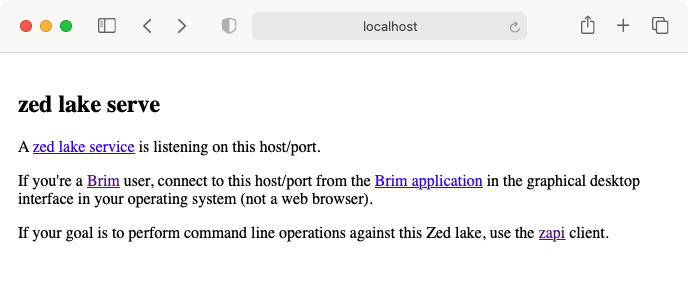

# Troubleshooting (v0.25.0 and newer)

> **Note:** The details in this article are specific to Brim release `v0.25.0`
> and newer. For information regarding release `v0.24.0` and older, review
> [this article](Troubleshooting).

If you're having a problem with Brim, please browse the following sections
before you [open an issue](#opening-an-issue).

- [Common Problems](#common-problems)
  * [I've clicked to open a packet capture in Brim, but it failed to open](#ive-clicked-to-open-a-packet-capture-in-brim-but-it-failed-to-open)
  * [I've clicked in Brim to extract a flow from my pcap into Wireshark, but the flow looks different than when I isolate it in the original pcap file in Wireshark](#ive-clicked-in-brim-to-extract-a-flow-from-my-pcap-into-wireshark-but-the-flow-looks-different-than-when-i-isolate-it-in-the-original-pcap-file-in-wireshark)
  * [Brim seems unable to restart normally, such as after a bad crash](#brim-seems-unable-to-restart-normally-such-as-after-a-bad-crash)
  * [Brim shows "Connection Error: The service at localhost:9867 could not be reached"](#brim-shows-connection-error-the-service-at-localhost9867-could-not-be-reached)
- [Gathering Info](#gathering-info)
  * [Sensitive Information (important!)](#sensitive-information-important)
  * [Screenshots/Videos](#screenshotsvideos)
  * [Developer Tools](#developer-tools)
  * [Logs](#logs)
  * [Sample Packet Captures](#sample-packet-captures)
  * [Large Files](#large-files)
- [Opening an Issue](#opening-an-issue)

# Common Problems

## I've clicked to open a packet capture in Brim, but it failed to open

Functionality related to pcaps in Brim releases `v0.25.0` and newer is
provided via [Brimcap](https://github.com/brimdata/brimcap#usage-with-brim-desktop-app).
This question is covered [here](https://github.com/brimdata/brimcap/wiki/Troubleshooting#ive-clicked-to-open-a-packet-capture-in-brim-but-it-failed-to-open)
in the Brimcap wiki.

## I've clicked in Brim to extract a flow from my pcap into Wireshark, but the flow looks different than when I isolate it in the original pcap file in Wireshark

Functionality related to pcaps in Brim releases `v0.25.0` and newer is
provided via [Brimcap](https://github.com/brimdata/brimcap#usage-with-brim-desktop-app).
This question is covered [here](https://github.com/brimdata/brimcap/wiki/Troubleshooting#ive-clicked-in-brim-to-extract-a-flow-from-my-pcap-into-wireshark-but-the-flow-looks-different-than-when-i-isolate-it-in-the-original-pcap-file-in-wireshark)
in the Brimcap wiki.

## Brim seems unable to restart normally, such as after a bad crash

Though we attempt to fix bad bugs in Brim soon after they're identified,
occasionally you may encounter a new bug that crashes the app in a way that
leaves it in a bad state. In these situations Brim will seem "stuck" each time
it starts, either at at a blank white screen (such as in previously-fixed issue
[brim/1099](https://github.com/brimdata/brim/issues/1099)) or showing an error
dump similar to the one below:


If you experience such a crash, please gather any error dump text and
[open an issue](#opening-an-issue) with as much detail as possible regarding
the steps you followed that led up to the crash.

Then to clear the condition, click **Window > Reset State** from the Brim
pull-down menu. This will clear some cached data from your previous use of Brim
(e.g., the contents of the **History** panel), but the data in your Pools will
remain intact.

Before resuming normal work in Brim, this would be a good opportunity to
retrace your steps and confirm that you've captured the reproduction steps
accurately in your [issue](#opening-an-issue), since you won't lose any history
if you repro/crash Brim and clear it one more time. Your assistance in helping
us squash these types of bad bugs is much appreciated. Thank you!

## Brim shows "Connection Error: The service at localhost:9867 could not be reached"

The following screenshot shows how this error is presented in Brim.



These failures are quite rare. Brim is regularly tested for successful
installation in "out-of-the-box" configurations of all supported platforms, so
it's likely that this type of failure may be due to some unique configuration
on your system that's preventing normal operation. Therefore, even if the tips
below help you get past the problem, it would be very helpful for you to still
share the details with us so we can provide guidance to ensure other users
avoid the problem in the future.

There have been a couple reports from Windows users who experienced these
symptoms after an upgrade to a newer Brim release. In each case the users
ultimately resolved the problem via system reboot. We've unfortunately been
unable to reproduce this problem or study a system "live" that's in this state
to determine the root cause or why the reboot fixed it. An issue
[brim/1490](https://github.com/brimdata/brim/issues/1490) is being kept open to
track this specific case. Even though a reboot might be an effective fix for
you also, your assistance would be much appreciated in still running
through the troubleshooting steps below and gathering the debug information.
If you ultimately find a reboot fixes the symptom for you, please add your logs
and details to [brim/1490](https://github.com/brimdata/brim/issues/1490).
In all other cases, please [open a new issue](#opening-an-issue).

To begin troubleshooting this, it helps to understand the "backend" of Brim.
One essential component is a [Zed Lake](https://github.com/brimdata/zed/blob/main/docs/lake/design.md),
a server-style process that manages the storage and querying of imported data.
Operations in the Pools of a Zed Lake are invoked via a [REST
API](https://en.wikipedia.org/wiki/Representational_state_transfer) that's
utilized by a "client", such as the Brim app. When run on your desktop,
`zed lake serve` is launched at startup by Brim and then listens for such API
connections on local TCP port `9867`.



Therefore, this particular error message indicates that for some reason Brim
was not able to successfully communicate with a `zed lake serve` process via
`localhost:9867`. In brief, the root cause is likely one of the following:

1. [A `zed lake serve` crash](#a-zed-lake-serve-crash)
2. [A failure to launch `zed lake serve`](#a-failure-to-launch-zed-lake-serve)
3. [No local communications between Brim and `zed lake serve`](#no-local-communications-between-brim-and-zed-lake-serve)

In all cases, you should plan to [open an issue](#opening-an-issue) with
Brim/Zed logs attached, as these may include crash/failure details. However,
for situations other than simple crashes, the problem may be related to
anti-virus tools that could block the install/upgrade of software and/or
firewalls that block communications between unfamiliar processes. You may
therefore need to work with your IT department to examine logs from such
utilities and determine if settings can be adjusted to allow Brim to operate.

The sections below describe additional debug you can perform to narrow down
among the above root causes. Please include your findings from these steps in
any issue you open, along with Brim/Zed logs and details on how you
reproduced the error.

### A `zed lake serve` crash

If you experience the error during normal operations in Brim (e.g., after you've
attempted to execute a query in the middle of an otherwise healthy session),
it's possible that the `zed lake serve` process suffered a fatal crash. If you
can reliably reproduce the crash by executing a particular query and/or with a
particular data source, please include this detail in your issue along with
attached logs.

### A failure to launch `zed lake serve`

If you experience the error when launching Brim (perhaps after an auto-update
to a new release), it's possible that system utilities prevented the
`zed lake serve` process from fully installing or starting. To narrow down if
this is occurring, it may help to compare the current running state to that of
a healthy installation.

Once you've launched Brim and have observed the error message, check the
running processes on your system and compare to the outputs shown below as
appropriate for your platform.

**Windows (Task Manager)**


**Linux [`pstree`](https://man7.org/linux/man-pages/man1/pstree.1.html)**

```
$ pstree
...
        |      |                 |               |-gnome-session-b-+-gnome-shell-+-brim-+-brim---brim-+-brim
        |      |                 |               |                 |             |      |             `-4*[{brim}]
        |      |                 |               |                 |             |      |-brim---brim
        |      |                 |               |                 |             |      |-brim---5*[{brim}]
        |      |                 |               |                 |             |      |-2*[brim---12*[{brim}]]
        |      |                 |               |                 |             |      |-zed---9*[{zed}]
        |      |                 |               |                 |             |      `-31*[{brim}]
```

**macOS [`pstree`](https://man7.org/linux/man-pages/man1/pstree.1.html)**

```
$ pstree
...
 |-+= 67726 phil /Applications/Brim.app/Contents/MacOS/Brim
 | |--- 67727 phil /Applications/Brim.app/Contents/Frameworks/Brim Helper (GPU).app/Contents/MacOS/Brim Helper (GPU) --type=gpu-process --field-trial-handle=1718379636,158416190604165762
 | |--- 67729 phil /Applications/Brim.app/Contents/Resources/app.asar.unpacked/zdeps/zed lake serve -l localhost:9867 -R /Users/phil/Library/Application Support/Brim/data/lake -log.level
 | |--- 67730 phil /Applications/Brim.app/Contents/Frameworks/Brim Helper.app/Contents/MacOS/Brim Helper --type=utility --utility-sub-type=network.mojom.NetworkService --field-trial-hand
 | |--- 67731 phil /Applications/Brim.app/Contents/Frameworks/Brim Helper (Renderer).app/Contents/MacOS/Brim Helper (Renderer) --type=renderer --field-trial-handle=1718379636,15841619060
 | \--- 67732 phil /Applications/Brim.app/Contents/Frameworks/Brim Helper (Renderer).app/Contents/MacOS/Brim Helper (Renderer) --type=renderer --field-trial-handle=1718379636,15841619060
```

If `zed` is absent from these outputs, it's possible that another process is
already running that's listening on TCP port 9867. To confirm this, completely
exit Brim and run `netstat -an` and look for instances of `:9867`.

If no such process is found, examine the logs of system utilities (perhaps
with assistance from an IT department) to look for indications of the `zed`
binary not having been fully installed (such as during auto-update to a
new release) or prevented from being launched.

### No local communications between Brim and `zed lake serve`

If the process tables indicated `zed` is running, the next thing to consider
is the local network connectivity. In an "out-of-the-box" desktop environment,
not only would Brim have been able to connect, but a direct connection from a
browser to `http://localhost:9867` would cause the following informational
message to be returned by `zed lake serve`.



It may help to use Wireshark to sniff TCP port 9867 traffic on your system's
loopback interface while attempting to access this URL in your browser. This
may help determine if packets are failing to make it to `zed`, not being
returned from `zed`, and/or if some other process is getting in the way of the
communications. It may be necessary to examine firewall logs (perhaps with
assistance from an IT department) to look for evidence of the connection
having been blocked.

# Gathering Info

Before [opening an issue](#opening-an-issue), or while debugging a
previously-opened issue, there's detail you can gather that may help us more
quickly provide you with a resolution.

## Sensitive Information (important!)

For all information described in this section, we understand that some of it
may be of a sensitive nature such that you don't feel you can attach it
directly to a public GitHub Issue. If you can crop, blur, or otherwise modify
the information before attaching, please do. If you feel you could share such
information only privately, please notify us on [public Slack](https://www.brimsecurity.com/join-slack/)
and we can arrange to receive it from you in a private 1-on-1 chat.

## Screenshots/Videos

If you think you've encountered a bug, a screenshot or recorded desktop video
of your Brim app that includes the error message or unexpected behavior may
help us a lot. If you can annotate your media with arrows, text, or other
detail, even better. The same is true if you're submitting a detailed feature
request.

## Developer Tools

Most of Brim's error messages should be surfaced within the app and include
enough detail for us to figure out the problem. However, if you've uncovered a
challenging bug, we may need your help to gather some additional detail. For
instance, this may come up with bugs where you're clicking in the app and you
expect a certain outcome but nothing seems to be happening.

A more detailed level of debug info may be hiding in a _Developer_ _Tools_ area
that's available in Brim, and it may help us a lot if you could check there to
see if more error info is being generated when you reproduce a problem. This
will work best with bugs that you can reliably reproduce.

To prepare, get to the point in the Brim app where you're _about_ _to_ trigger
the problem, but have not triggered it yet. Then from the menu bar, select
**View > Toggle Developer Tools**. This will reveal a new panel on the right
side of the app window, as outlined in red below.


Once the panel is revealed, inside it first click to the **Console** tab, then
click the circle with the line through it to clear the console of any existing
messages.


Now perform the operation in the app that triggers the problem. Hopefully this
will reveal some error messages in the **Console** area of the panel. If this
is the case, please take a screenshot and include it with your issue.

## Logs

Logs are generated by the Brim app and the `zed lake serve` process it
launches (the engine for querying your data). These are located in the
`logs` subdirectory under the Brim [user data](Filesystem-Paths#user-data-all-versions)
path.

Please include a ZIP of the contents of this directory along with any issue
you open to report a bug.

## Sample Packet Captures

If your problem involves a pcap file, we'll likely be able to debug much quicker
if you can attach a sample pcap file to your issue. If you are able to
reproduce the issue using a small pcap that you're certain does not contain
sensitive information, that would be ideal.

## Large Files

If you have a video or sample pcap that is too large to attach to a GitHub
Issue, please upload it to the file-sharing service of your choosing and paste
a link to it in your issue.

# Opening an Issue

Before/when [opening a new issue](https://github.com/brimdata/brim/issues/new/choose),
you can help us out by doing the following:

* Review the [common problems](#common-problems) above see if you're hitting one of those.
* Browse the existing [open issues](https://github.com/brimdata/brim/issues?q=is%3Aissue+is%3Aopen). If you confirm you're hitting one of those, please add a comment to it rather than opening a new issue.
* [Gather info](#gathering-info) that may help in reproducing the issue and testing a fix, and attach it to your issue.
* Feel free to chat with the team on the [public Slack](https://www.brimsecurity.com/join-slack/) before/after opening an issue.
* When you open a new issue, its initial text will include a template with standard info that will almost always be needed. Please include detail for all areas of the template.

Thanks for helping us support the Brim community!
