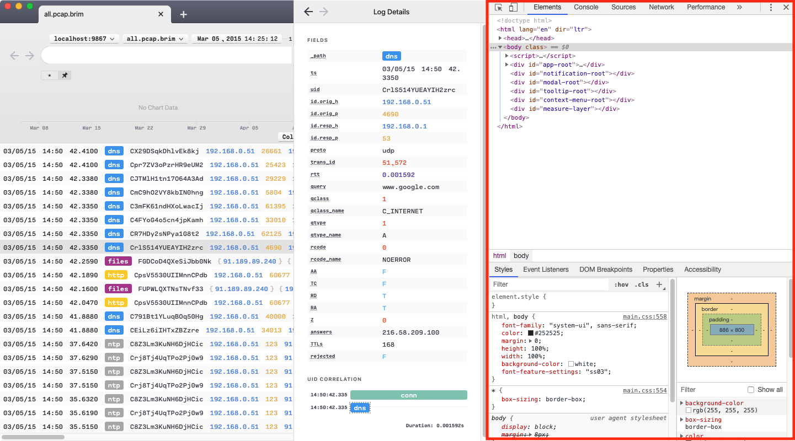
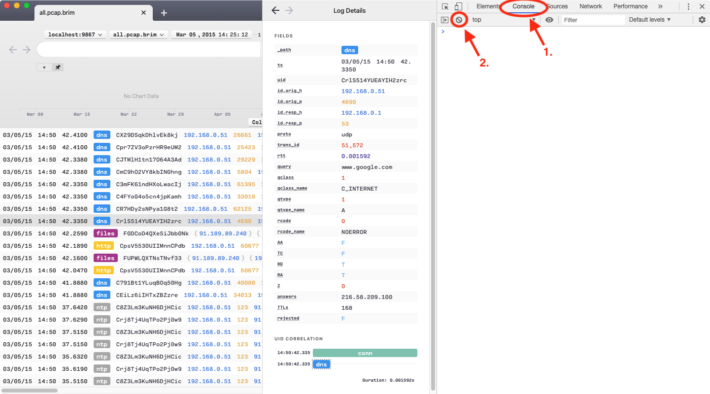

# Troubleshooting

If you're having a problem with Brim, please browse the following sections
before you [open an issue](#opening-an-issue).

- [Common Problems](#common-problems)
  * [I've clicked to open a packet capture in Brim, but it failed to open](#ive-clicked-to-open-a-packet-capture-in-brim-but-it-failed-to-open)
  * [I've clicked in Brim to extract a flow from my pcap into Wireshark, but the flow looks different than when I isolate it in the original pcap file in Wireshark](#ive-clicked-in-brim-to-extract-a-flow-from-my-pcap-into-wireshark-but-the-flow-looks-different-than-when-i-isolate-it-in-the-original-pcap-file-in-wireshark)
  * [Brim seems unable to restart normally, such as after a bad crash](#brim-seems-unable-to-restart-normally-such-as-after-a-bad-crash)
- [Gathering Info](#gathering-info)
  * [Sensitive Information (important!)](#sensitive-information-important)
  * [Screenshots/Videos](#screenshotsvideos)
  * [Developer Tools](#developer-tools)
  * [Logs](#logs)
  * [Sample Packet Captures](#sample-packet-captures)
  * [Large Files](#large-files)
- [Opening an Issue](#opening-an-issue)

# Common Problems

## I've clicked to open a packet capture in Brim, but it failed to open

Unfortunately, not all packet captures are created equal. The library that
Brim invokes to extract flows from your pcap handles the most common variations
we've encountered, but you may have come across a corner case that it wasn't
prepared to handle.

Such problems are often due to file format variations that are unique to the
system that generated the capture. In such situations, the most expedient debug
path would be to send us the capture file so our developers can use it to
reproduce the problem, fix it, and create automated tests to ensure the problem
doesn't arise again in the future. We understand that concerns regarding
[sensitive information](#sensitive-information-important)
may make it difficult or impossible to share such data. If the specific
capture with which you first saw the problem cannot be shared, an alternative 
approach would be to share a special debug capture generated by the same
system, but made up of traffic known to be innocuous (e.g. performing a
`curl` to a common public web site). If you're able to share your original
capture file, or can share a special debug capture that also reproduces the
problem, please [open a bug report](#opening-an-issue) and attach it along with
a [screenshot](#screenshotsvideos) or cut & paste of any error message you saw
in Brim. These alone should be adequate for us to start working on a fix.
However, if you cannot share your data, proceed with the following steps.

First, if you don't see an error message in Brim, or the error seems terse and
unhelpful, it may help us get to the bottom of it faster if you include the
debug info from [Developer Tools](#developer-tools).

Beyond that, the most comprehensive way to debug is to use the
[zq](https://github.com/brimsec/zq) toolset at the command line to perform
steps that are functionally equivalent to those initiated by the Brim
application to extract flows from your pcap. This will allow you to better
observe the individual steps in the packet extraction so you can report the
point at which you see a failure. This consists of the following steps:

1. Install the zq toolset by following the
[installation steps in the zq README](https://github.com/brimsec/zq/blob/master/README.md#installation).
Ensure you can run the `pcap` executable, which is needed for this exercise.
   ```
   $ pcap
   NAME
       pcap - pcap creates time index files for pcaps

   USAGE
       pcap [global options] command [options] [arguments...]
   ...
   ```

2. Build a packet index for your capture file. For example, assuming a capture
in a file named `hello.pcapng`:
   ```
   $ pcap index -r hello.pcapng -x hello.idx
   ```

3. Print some sample packet timestamps from your capture. An example output
from our sample pcap (your timestamps will differ):
   ```
   $ ./pcap ts -r hello.pcapng 
   1583768523.826851
   1583768523.826857
   1583768523.826968
   ...
   ```
4. To extract a portion of the capture by using the index, create a
`pcap slice` command line like the one shown below. Use any of the timestamps
near the top of the output in step #3 as the `-from` parameter and a
timestamp from later in the output as the `to` parameter. An example command
line (your timestamps will differ):
   ```
   $ ./pcap slice -x hello.idx -r hello.pcapng -from 1583768523.826851 -to 1583768523.826968 > tmp.pcapng
   ```

Brim normally invokes steps similar to those shown above by making API calls
to the [`zqd`](https://github.com/brimsec/zq/tree/master/cmd/zqd) process that
is launched when Brim starts. Specifically, step #2 is performed when you import
your pcap into Brim, then information from the generated Zeek `conn` records
provide timestamps similar to those you gathered in step #3, and then the
extraction performed in step #4 should result in a packet capture file that's
readable in Wireshark.

If you run through the above steps using a pcap for which you've successfully
opened flows in Brim before, the `tmp.pcapng` that's output in the last step
should, indeed, open successfully in Wireshark. Then when you run through the
same steps using your problem pcap, one of the above steps should produce
errors that you can paste into your [bug report](#opening-an-issue) to help us
understand the problem.

## I've clicked in Brim to extract a flow from my pcap into Wireshark, but the flow looks different than when I isolate it in the original pcap file in Wireshark

Brim uses [Zeek](https://zeek.org/) to create summary logs from pcaps. 
Zeek and Wireshark for the most part treat flows similarly. But we're aware 
of some subtle differences that you may notice, and
there may be other differences of which we're not yet aware.

In Wireshark, you can right-click on a TCP/UDP packet and select _Follow TCP
Stream_ or _Follow UDP Stream_, which will apply a filter of the format
`tcp.stream eq N` or `udp.stream eq N`, where `N` is a number `0`, `1`, etc.
based on which flow within the pcap is being isolated. When this is done,
Wireshark appears to treat all packets as part of the same flow if they
share the same [5-tuple](https://www.caida.org/research/traffic-analysis/flowtypes/),
regardless of how long the flow lasts.

Separately, Brim relies on Zeek's `conn` event, which includes the `id` and
`proto` fields that capture the 5-tuple for a flow, along with the fields for
`ts` (time of first packet) and `duration` (how long the connection lasted).
Brim uses all this information to extract the flow from the indexed pcap file.
However, this is where Zeek's occasionally different perception of flows may
come into play.

For starters, Zeek's [`conn` documentation](https://docs.zeek.org/en/current/scripts/base/protocols/conn/main.zeek.html#type-Conn::Info)
discloses that the time span covered by the `duration` field "will not include the final ACK [...] for 3-way or 4-way [TCP] connection tear-downs". Therefore
a TCP flow extracted via Brim is likely to be missing such an ACK.

Separately, for UDP flows, Zeek has a `udp_inactivity_timeout` that defaults to
one minute. This means that UDP flows that don't send or receive traffic for
60 seconds will have their flow state "flushed" from Zeek into a completed
`conn` event. If the flow is actually still active in the capture such that
more packets for the 5-tuple reappear after the 60 second timeout, a new `conn`
record would be created by Zeek (and hence would appear separately in Brim, and
therefore be extracted from the original pcap as if it were a separate flow).

These represent what we expect may be the majority of observed differences in
flow handling. However, through side-by-side study of Wireshark next to Zeek,
we've uncovered the following additional corner cases that may also yield
differences:

|**Issue**|**Description**|
|-|-|
|[zeek/846](https://github.com/zeek/zeek/issues/846)|"ts+duration" for TCP flow is missing more than just ACK|
|[zeek/847](https://github.com/zeek/zeek/issues/847)|Zeek creates many conn records for DNS despite `udp_inactivity_timeout=0`|
|[zeek/862](https://github.com/zeek/zeek/issues/862)|Retransmissions of unsuccessful close attempt keep getting flagged as new connections|
|[zeek/864](https://github.com/zeek/zeek/issues/864)|Multi-section pcapng with overlapping timestamps creates excess `conn` events|

If you find yourself running into these issues or others of a similar nature,
please reach out to us on our [public Slack](https://join.slack.com/t/brimsec/shared_invite/zt-cy34xoxg-hZiTKUT~1KdGjlaBIuUUdg)
or [open an issue](#opening-an-issue) and we'll try to help.

## Brim seems unable to restart normally, such as after a bad crash

Though we attempt to fix bad bugs in Brim soon after they're identified,
occasionally you may encounter a new bug that crashes the app in a way that
leaves it in a bad state. In these situations Brim will seem "stuck" such that
neither selecting the **Reset State**/**Reload** options from the drop-down
menu nor restarting Brim will clear the situation. Here is an example of such
a crash from previous issue [#652](https://github.com/brimsec/brim/issues/652),
which has since been fixed:


If you experience such a crash, please gather the error dump text and
[open an issue](#opening-an-issue) with as much detail as possible regarding
the steps you followed that led up to the crash.

Then to clear the condition, exit Brim and delete the `appState.json` from
your filesystem at the location shown below for your OS platform. Once deleted,
restart Brim.

|**OS Platform**|**Location**|
|---------------|------------|
| **Windows**   | `%APPDATA%\Brim\appState.json` |
| **macOS**     | `$HOME/Library/Application Support/Brim/appState.json` | 
| **Linux**     | `$HOME/.config/Brim/appState.json` | 

This will clear some cached data from your previous use of Brim (e.g. the
contents of the **History** panel), but the data for your Spaces will remain
intact.

Before resuming normal work in Brim, this would be a good opportunity to
retrace your steps and confirm that you've captured the reproduction steps
accuately in your [issue](#opening-an-issue), since you won't lose any history
if you repro/crash Brim and clear it one more time. Your assistance in helping
us squash these types of bad bugs is much appreciated. Thank you!

# Gathering Info

Before [opening an issue](#opening-an-issue), or while debugging a
previously-opened issue, there's detail you can gather that may help us more
quickly provide you with a resolution.

## Sensitive Information (important!)

For all information described in this section, we understand that some of it
may be of a sensitive nature such that you don't feel you can attach it
directly to a public GitHub Issue. If you can crop, blur, or otherwise modify
the information before attaching, please do. If you feel you could share such
information only privately, please notify us on [public Slack](https://join.slack.com/t/brimsec/shared_invite/zt-cy34xoxg-hZiTKUT~1KdGjlaBIuUUdg)
and we can arrange to receive it from you in a private 1-on-1 chat.

## Screenshots/Videos

If you think you've encountered a bug, a screenshot or recorded desktop video
of your Brim app that includes the error message or unexpected behavior may
help us a lot. If you can annotate your media with arrows, text, or other
detail, even better. The same is true if you're submitting a detailed feature request.

## Developer Tools

Most of Brim's error messages should be surfaced within the app and include
enough detail for us to figure out the problem. However, if you've uncovered a
challenging bug, we may need your help to gather some additional detail. For
instance, this may come up with bugs where you're clicking in the app and you
expect a certain outcome but nothing seems to be happening.

A more detailed level of debug info may be hiding in a _Developer_ _Tools_ area
that's available in Brim, and it may help us a lot if you could check there to
see if more error info is being generated when you reproduce a problem. This
will work best with bugs that you can reliably reproduce.

To prepare, get to the point in the Brim app where you're _about_ _to_ trigger
the problem, but have not triggered it yet. Then from the menu bar, select
**View > Toggle Developer Tools**. This will reveal a new panel on the right
side of the app window, as outlined in red below.



Once the panel is revealed, inside it first click to the **Console** tab, then
click the circle with the line through it to clear the console of any existing
messages.



Now perform the operation in the app that triggers the problem. Hopefully this
will reveal some error messages in the **Console** area of the panel. If this
is the case, please take a screenshot and include it with your issue.

## Logs

Logs are generated by the Brim app and the `zqd` process it launches (the
engine for querying your data). These are located in:

|**OS Platform**|**Location**|
|---------------|------------|
| **Windows**   | `%APPDATA%\Brim\logs` |
| **macOS**     | `$HOME/Library/Application Support/Brim/logs` | 
| **Linux**     | `$HOME/.config/Brim/logs` | 

Please include a ZIP of the contents of this directory along with any issue
you open to report a bug.

## Sample Packet Captures

If your problem involes a pcap file, we'll likely be able to debug much quicker
if you can attach a sample pcap file to your issue. If you are able to
reproduce the issue using a small pcap that you're certain does not contain
sensitive information, that would be ideal.

## Large Files

If you have a video or sample pcap that is too large to attach to a GitHub
Issue, please upload it to the file-sharing service of your choosing and paste
a link to it in your issue.

# Opening an Issue

Before/when [opening a new issue](https://github.com/brimsec/brim/issues/new/choose),
you can help us out by doing the following:

* Review the [common problems](#common-problems) above see if you're hitting one of those.
* Browse the existing [open issues](https://github.com/brimsec/brim/issues?q=is%3Aissue+is%3Aopen). If you confirm you're hitting one of those, please add a comment to it rather than opening a new issue.
* [Gather info](#gathering-info) that that may help in reproducing the issue and testing a fix, and attach it to your issue.
* Feel free to chat with the team on the [public Slack](https://join.slack.com/t/brimsec/shared_invite/zt-cy34xoxg-hZiTKUT~1KdGjlaBIuUUdg) before/after opening an issue.
* When you open a new issue, its initial text will include a template with standard info that will almost always be needed. Please include detail for all areas of the template.

Thanks for helping us support the Brim community!
