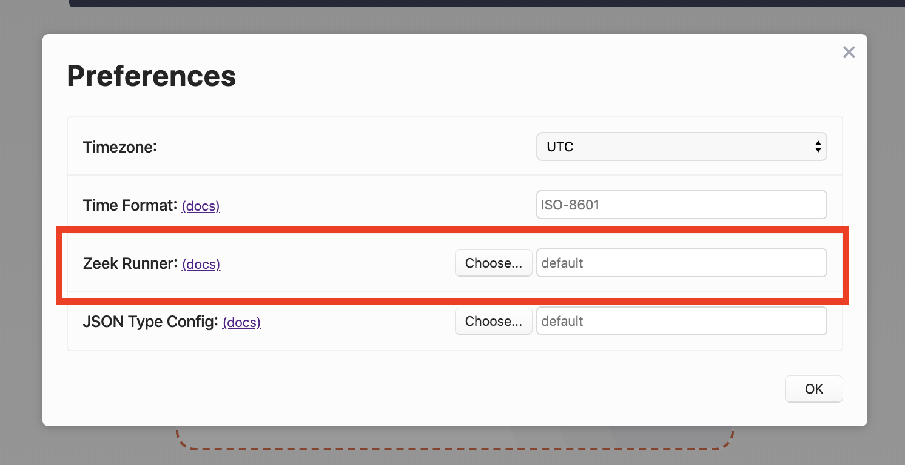

# Zeek Customization

- [Summary](#summary)
- [Contact us!](#contact-us)
- [Details](#details)

# Summary

Brim uses [Zeek](https://www.zeek.org) to generate Zeek logs from pcaps; the Zeek logs are then combined and stored in
 [ZNG](https://github.com/brimsec/zq/blob/master/zng/docs/spec.md) format. Brim comes with a Zeek bundle
it uses just for this process.

Starting with `v0.10.0`, Brim can be configured to use a Zeek setup other than its default. This may be useful for:

   * Users with an existing Zeek installation, to generate logs in Brim similar to their existing Zeek logs.
   * Users that want to experiment with a Zeek configuration different from the Brim default.
   * Zeek script authors that would like to use Brim as a script development aid.

To use a different Zeek setup, there is now a Brim preference to specify the Zeek "runner", an executable script or 
command run when a pcap import occurs, which launches Zeek to read the pcap's data & write Zeek logs.

# Contact us!

If you're using a custom Zeek setup with Brim, we'd like to hear from you! Whether you've found an interesting 
Zeek feature that could be useful to other Brim users, or are generating logs that match your existing Zeek setup, 
or (especially) if you hit challenges and need help, please join our
[public Slack](https://join.slack.com/t/brimsec/shared_invite/zt-cy34xoxg-hZiTKUT~1KdGjlaBIuUUdg)
and tell us about it, or
[open an issue](https://github.com/brimsec/brim/wiki/Troubleshooting#opening-an-issue). Thanks!

# Details

Brim uses an executable script or command, called a Zeek "runner", to execute Zeek with any needed environment variables,
command line options, or other configuration. A Brim preference is available to specify the location of the Zeek runner
to use. To use a different Zeek setup to generate logs from pcaps, you should provide a runner that references the
desired Zeek setup.

Below is the runner used by Linux and macOS for Brim v0.10.0. It's a script located at the top of the builtin
Zeek bundle's installation directory, so it refers to the Zeek executable and other paths relative to its own location.
When a user imports a pcap file into Brim, the runner is executed with the pcap's data passed via stdin, and the 
runner's working directory set to the desired output location for the Zeek logs. 

```bash
#!/usr/bin/env bash

dir="$(cd "$(dirname "${BASH_SOURCE[0]}")" >/dev/null 2>&1 && pwd)"

export ZEEKPATH=$dir/share/zeek:$dir/share/zeek/policy:$dir/share/zeek/site
export ZEEK_PLUGIN_PATH=$dir/lib/zeek/plugins

# The packet filter and loaded scripts are disabled because they emit either
# timeless logs or logs with timestamp set to execution time rather than time
# of capture.
exec "$dir/bin/zeek" \
  -C -r - \
  --exec "event zeek_init() { Log::disable_stream(PacketFilter::LOG); Log::disable_stream(LoadedScripts::LOG); }" \
  local
```

The above script works as-is for a Zeek installation created by the Zeek build system. So, if you've built Zeek locally
via `./configure --prefix=/usr/local/myzeek`, you could copy the above script to `/usr/local/myzeek/zeekrunner`, then
specify `/usr/local/myzeek/zeekrunner` in the Brim preferences, restart Brim, and then import pcaps using the Zeek
setup at `/usr/local/myzeek`.

**Note:** If you change the location of the Zeek runner, you'll need to restart Brim. However, a
restart is only required if the location of the runner changes, not if the runner itself is updated. If you edit the
runner without altering its location, any changes will take effect on the next pcap import.

You can specify the location of your Zeek runner via the setting in the **Preferences** menu:



