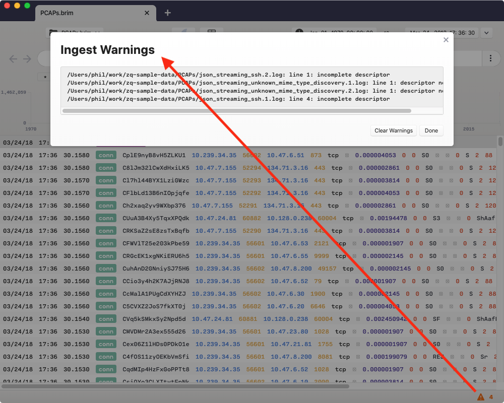
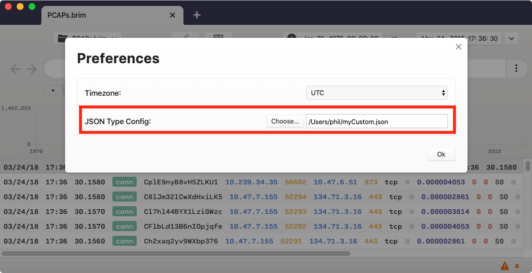

# Zeek JSON Import

- [Summary](#summary)
- [Contact us!](#contact-us)
- [Details](#details)

# Summary

Starting with `v0.9.0`, Brim allows for direct import of Zeek logs. When such
imported logs are in JSON format, the [`zq`](https://github.com/brimsec/zq)
engine inside of Brim applies a
[JSON type definition](https://github.com/brimsec/zq/tree/master/zeek/README.md)
to restore Zeek-compatible rich data types to the events. The article at that
hyperlink describes the importance of the type definition configuration and
how to customize it for your environment, if necessary.

# Contact us!

If you're using JSON type defintions with `zq` or Brim, we'd like to hear from
you! We know the process of customizing the definitions can be tricky. We have
ideas for ways we might improve it, but we'll have a better sense of priority
and how to go about it if we've heard from those who have tried it. Whether
you've used this feature and it "just worked" or if you hit challenges and need
help, please join our
[public Slack](https://join.slack.com/t/brimsec/shared_invite/zt-cy34xoxg-hZiTKUT~1KdGjlaBIuUUdg)
and tell us about it, or
[open an issue](https://github.com/brimsec/brim/wiki/Troubleshooting#opening-an-issue). Thanks!

# Details

When working in Brim, you'll know customization of the type definition is
likely necessary if you see warning messages when importing Zeek JSON logs,
such as the screenshot below. These warnings are equivalent to those shown in
the ["Handling exceptions"](https://github.com/brimsec/zq/tree/master/zeek#handling-exceptions)
section of the `zq` documentation.

You may find it easiest to complete the customization exercise using `zq`,
following
[that documentation](https://github.com/brimsec/zq/tree/master/zeek/README.md).
However, if you prefer to work exclusively within Brim, the same type defintion
config referenced in the `zq` documentation comes bundled with the Brim
application and can be located on your filesystem at:

|**OS Platform**|**Location**|
|---------------|------------|
| **Windows**   | `%LOCALAPPDATA%\Brim\app-[version]\resources\app\config\defaultTypes.json` |
| **macOS**     | `/Applications/Brim.app/Contents/Resources/app/config/defaultTypes.json` | 
| **Linux**     | `/usr/lib/brim/resources/app/config/defaultTypes.json` | 

Following a similar workflow as described in the `zq` documentation, you can
copy this file to make modifications or generate a new one using the
[`print-types.zeek`](https://github.com/brimsec/zeek/blob/master/brim/print-types.zeek)
script. You can point your Brim application at your modified type definition
file via the setting in the **Preferences** menu.

The type definition file referenced here will be used in place of the default
one. At this point you can repeat the import of your Zeek JSON logs until
you've eliminated the warnings.
